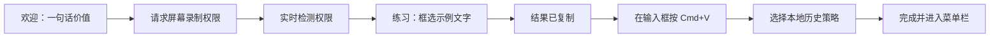
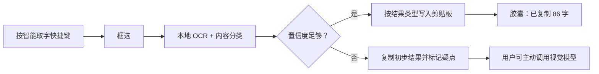
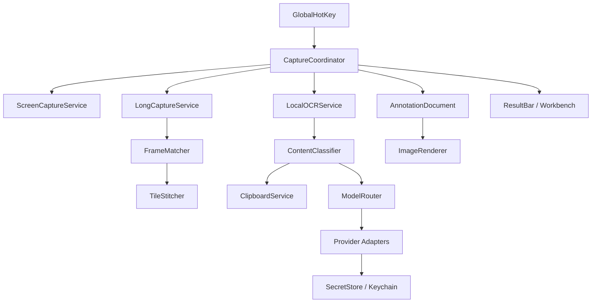

# AI 截图软件产品需求文档（PRD）

> 产品名称：拓（英文名：Ta；原项目代号：AI Screenshot）
> PRD 版本：v1.0
> 文档日期：2026-08-22
> 首发平台：macOS
> 文档状态：产品方向已确认，待交互原型与技术 Spike
> 前置研究：[AI 截图软件市场与用户痛点调研](./AI截图软件市场与用户痛点调研.md)

**阅读导航**

- 0–5：结论、用户、定位、差异化与版本边界。
- 6–8：信息架构、关键流程和 Typeless 方向的页面设计。
- 9–12：逐项功能需求、模型、隐私和异常降级。
- 13–17：macOS 技术方案、数据、性能、指标和测试。
- 18–22：里程碑、风险、商业假设、待决策项和发布门槛。
- 23：研究与技术来源。

---

## 0. 一页结论

### 0.1 产品是什么

一款 **macOS 优先、本地优先、截图后立即得到可用结果** 的 AI 截图工具。

它不是在传统截图软件里加一个聊天框，而是把截图变成统一入口：用户按快捷键框选屏幕内容后，可以直接得到文字、代码、表格、长图，或一张已经标注和美化好的发布图片，并立即复制、粘贴、拖拽或继续处理。

一句话定位：

> **截完即得：把屏幕内容瞬间变成可粘贴的信息，或可直接发布的图片。**

### 0.2 首版必须成立的三件事

1. **截图即结果（方案 A）**：快捷键 → 框选 → 本地 OCR → 自动复制，不打开主窗口也能完成任务。
2. **可靠长截图**：不仅能拼接，还能发现重复、断层和固定标题造成的问题，并允许人工修复。
3. **标注与一键美化**：满足微信公众号、教程和社交媒体创作者的日常出图需求，截图后无需再进入 Canva、Figma 或 Photoshop 做基础加工。

### 0.3 产品公式

> TextSniper 的极短路径 + CleanShot X / Shottr 的完成度 + Xnapper 的一键美化 + Typeless 的低打扰交互 + AI 对屏幕内容的理解。

### 0.4 最重要的产品判断

- “支持很多模型”不是卖点；**少操作、结果可靠、隐私可见** 才是卖点。
- 传统截图工具的常用能力全部进入产品蓝图，但不要求全部成为首版发布阻塞项。
- AI 必须增强结果，不能增加截图主链路的等待和认知负担。
- 参数化美化先于生成式美化：先保证一键套用预设后 2 秒内出现稳定预览，再做 AI 扩图、换背景等实验能力。
- 本地 OCR 无需账号和 API Key；用户只有在主动使用云端 AI 时才需要配置模型。

---

## 1. 背景与市场机会

### 1.1 用户当前流程

典型的信息提取流程：

```text
截图 → 保存图片 → 打开另一个 OCR/AI 工具 → 再次框选/上传
    → 复制文字 → 修正格式 → 粘贴
```

创作者的流程更长：

```text
截图 → 标注 → 导入设计工具 → 加背景/留白/圆角/标题
    → 调整公众号比例 → 导出 → 再上传
```

问题不在于市场上没有截图工具，而在于现有工具通常只完成“拿到一张图片”，没有完成用户真正想做的下一步。

### 1.2 市场机会

前置调研得出以下判断：

- [TextSniper](https://textsniper.app/) 已证明“快捷键—框选—复制文字”本身就是可付费的独立需求。
- [CleanShot X](https://cleanshot.com/)、[Shottr](https://shottr.cc/) 和 [PixPin](https://pixpin.com/) 证明用户愿意为速度、长截图、标注和完成度付费。
- [Xnapper](https://xnapper.com/) 证明截图后的自动排版、美化和社交比例具有稳定需求。
- [ShareX](https://github.com/ShareX/ShareX) 和 [Flameshot](https://github.com/flameshot-org/flameshot) 的社区反馈表明：功能越多，越容易出现界面臃肿、剪贴板、多显示器、权限和滚动截图可靠性问题。
- [NormCap](https://github.com/dynobo/normcap)、[eSearch](https://github.com/xushengfeng/eSearch) 最接近开源“截图取字”方向，但开源 AI 截图品类目前尚未出现兼具成熟度、体验和信任的公认赢家。
- AI 屏幕助手正在出现，但多数产品把“问模型”放在“给结果”之前，速度、隐私和可控性仍有空间。

具体竞品、GitHub Issues、Reddit 讨论和来源见[调研文档](./AI截图软件市场与用户痛点调研.md)。

### 1.3 为什么先做 macOS

- macOS 创作者、开发者、知识工作者集中，对 CleanShot X、Shottr、TextSniper 等付费工具已有认知。
- 系统提供 ScreenCaptureKit、Vision、Keychain 等原生能力，适合实现低延迟、本地 OCR 和安全密钥存储。
- 首版原生化可以优先解决快捷键、浮层、剪贴板、Retina、多显示器和系统权限等核心体验问题。
- 避免为了过早跨平台而把第一版做成启动慢、内存高、系统感弱的通用壳。

Windows 进入产品蓝图，但不进入 v1 发布范围。

---

## 2. 产品目标、非目标与原则

### 2.1 v1 产品目标

| 编号 | 目标 | 成功定义 |
|---|---|---|
| G-01 | 建立“屏幕上有拿不走的内容，就按这个快捷键”的用户习惯 | 新用户首次启动 5 分钟内完成截图并成功粘贴；日常多数任务无需打开主窗口 |
| G-02 | 比传统截图 + OCR 组合至少少两个步骤 | 高频路径只需快捷键、框选两步，松手后自动复制 |
| G-03 | 覆盖可靠的基础截图能力 | 区域、窗口、全屏、长截图、标注、复制、保存均可独立完成 |
| G-04 | 让创作者直接产出可发布截图 | 微信公众号常用截图可在应用内完成标注、美化和导出 |
| G-05 | 建立对 AI 数据流的信任 | 本地处理与云端处理有明确标识；上传前可见范围；API Key 安全存储 |
| G-06 | 保持 macOS 原生的轻和快 | 常驻不打扰，快捷键触发迅速，核心离线能力无账号可用 |

### 2.2 v1 非目标

- 不做完整录屏与视频剪辑器。
- 不做团队云盘、评论、审核、访问统计和外链管理。
- 不做全天候连续截屏或“屏幕记忆”产品。
- 不做 Photoshop/Figma 式复杂图层、钢笔和排版系统。
- 不以“一次支持十几个模型提供商”为发布标准。
- 不默认把任何截图、OCR 文本或历史发送到产品服务器。
- 不在 v1 支持 Windows、iOS 或浏览器插件。

### 2.3 产品原则

1. **结果优先**：默认直接完成，不把用户送进工具窗口。
2. **本地优先**：能用本地 Vision OCR、规则和图像处理完成的任务，不调用云端。
3. **渐进披露**：新手只看见当前任务；高级选项在展开层、命令面板和设置中出现。
4. **可逆可解释**：AI 标注、美化、遮挡和裁切均保留原图，可撤销，可比较。
5. **可靠性高于功能数**：剪贴板、快捷键和拼接失败必须可见、可恢复。
6. **有观点的默认值**：默认模板和动作要好用，用户不必先学习十项参数。
7. **不抢焦点**：结果反馈类似 Typeless 的状态胶囊，不强制切换应用。

### 2.4 V1 范围准入规则

> 新功能只有在直接缩短“取内容、取完整内容、出可发布图片”三条路径之一，能避免用户切换到另一款软件，并且具备明确验收标准时，才可进入 V1；其余能力进入 P1/P2 蓝图。

---

## 3. 目标用户与核心任务

### 3.1 第一目标用户：内容创作者与研究者

典型对象：微信公众号作者、教程作者、产品运营、AI 内容创作者、研究员。

高频任务：

- 从网页、视频、PDF、聊天或无法复制的界面提取文字。
- 截取一段很长的网页、聊天记录或文档。
- 给截图加箭头、序号、重点框、马赛克和说明文字。
- 加背景、留白、圆角、阴影、标题和水印，输出公众号正文图或封面素材。
- 将多张步骤截图快速排成教程图。
- 翻译、总结、提取引用，或把截图内容改写成正文。

### 3.2 第二目标用户：开发者与产品团队

- 提取报错、终端输出、代码片段和配置文本。
- 截图后直接解释报错或生成可复制的 Markdown code block。
- 标注 UI Bug，自动加步骤序号和重点框。
- 对比两版界面，找文字或视觉差异。
- 隐藏 Token、邮箱、域名、账号等敏感内容后分享。

### 3.3 第三目标用户：办公与知识工作者

- 提取表格、票据、会议截图、PPT 和扫描文档中的内容。
- 将截图表格复制到 Excel/飞书表格，而不是得到一坨纯文本。
- 把聊天截图总结为结论和待办。
- 对长文档或网页做完整留档。

### 3.4 Jobs-to-be-Done

主 JTBD：

> 当屏幕上出现无法直接复制、难以整理或需要快速分享的内容时，我想用一次框选得到可粘贴、可编辑、格式正确的结果，这样我能留在当前工作上下文，而不是切换多个应用。

辅助 JTBD：

> 当我准备发布教程或公众号内容时，我想把截图快速标清楚、排好看，并自动适配发布比例，这样我不必为了每一张图打开专业设计工具。

### 3.5 关键痛点排序

| 等级 | 痛点 | 产品响应 |
|---|---|---|
| P0 | 截图后 OCR 步骤太多 | 截图后自动识别并复制，主流程不出现确认窗口 |
| P0 | OCR 结构丢失，代码/表格无法直接用 | 内容分类 + 多格式输出 + 原图对照校对 |
| P0 | 剪贴板偶尔无结果或粘贴不兼容 | 剪贴板写入验证、重试、格式切换和目标应用测试矩阵 |
| P0 | 分享/问 AI 时泄露敏感信息 | 本地识别、上传区域预览、敏感信息提醒、手动/智能遮挡 |
| P1 | 长截图重复、断层、固定标题多次出现 | 拼接质量检测、固定区域识别、暂停与人工校正 |
| P1 | 功能丰富后界面越来越难用 | 捕获层、结果条、工作台三层分离 |
| P1 | 截图堆积后找不到 | 本地近期历史、OCR 搜索；语义搜索进入 1.x |
| P1 | 多显示器、HDR、缩放和权限导致失败 | 从 Alpha 开始建立兼容矩阵和诊断页 |
| P2 | 截图不好看，仍需设计工具 | 参数化美化、公众号预设、AI 标注和教程卡片 |

---

## 4. 产品定位与差异化

### 4.1 三种产品方向的取舍

| 方向 | 描述 | 决策 |
|---|---|---|
| A. 截图即结果 | 截图后自动变成可以立即粘贴的文字/图片/结构化数据 | **首版主线** |
| B. AI 屏幕助手 | 对截图提问、总结、翻译、解释和执行动作 | 作为结果条的次级动作，逐步扩展 |
| C. AI 截图工作室 | 标注、美化、模板、生成背景和教程卡片 | 首版包含刚需编辑与美化，复杂生成能力实验性开放 |

### 4.2 核心差异化

#### D-01 一次截图，多种可用结果

同一张截图保留原图、OCR 文本、结构化结果和操作历史。用户可复制为纯文本、富文本、Markdown、代码块、TSV/CSV/Markdown 表格、图片或美化图片。

#### D-02 自动判断内容，不让用户先选工具

框选后先在本地判断是普通文本、代码、表格、二维码、界面还是纯图片，再推荐最可能的下一步。识别失败时退回“纯文本 + 原图”，不阻塞结果。

#### D-03 长截图有质量检查

传统长截图只负责拼接；本产品还要告诉用户哪里可能重复、断裂或被动态内容污染，并允许局部重拍、删除重复段、调整接缝。

#### D-04 为中文创作者设计的发布工作流

提供微信公众号正文图、封面素材、教程步骤图、对比图和长图预设；AI 可建议标题区、重点框、序号与说明，但最终由用户确认。

#### D-05 数据路径可见

结果条明确区分“本地完成”和“将发送到某模型”。云端请求默认只发送框选区域；用户可在发送前遮挡、裁切或取消。

#### D-06 模型自由但不暴露复杂度

默认本地完成基础 OCR。需要云端时可使用 BYOK、自定义 OpenAI-compatible Base URL 或本地 Ollama。模型细节位于设置，不占据主界面。

#### D-07 Typeless 式低打扰体验

任务从当前应用中开始，也在当前应用中结束。默认只出现一个短暂状态胶囊，不弹主窗口、不抢键盘焦点。

#### D-08 三类资产始终关联

原始截图、结构化内容和标注/美化版本属于同一个 Capture Artifact，可随时回到原图或重新输出，避免重复截图。

### 4.3 竞品定位对照

| 维度 | 专业截图工具 | OCR 工具 | AI 截图助手 | 本产品目标 |
|---|---|---|---|---|
| 默认结果 | 图片 | 纯文本 | AI 回答 | 可直接使用的文本/结构/图片 |
| 最短路径 | 截图后再选动作 | 很短 | 通常需要输入问题 | 截图后自动完成，动作可选 |
| 长截图 | 有，但失败原因不透明 | 少见 | 不稳定 | 拼接 + 质量诊断 + 修复 |
| 美化 | 标注或模板二选一 | 无 | 较少 | 标注、美化、创作者预设一体 |
| 隐私 | 产品差异大 | 多数本地 | 常需上传 | 本地优先，上传范围可见 |
| AI | 附加按钮 | 较少 | 主体 | 在合适内容和失败点出现 |
| 复杂度 | 容易堆功能 | 极简但能力窄 | 模型概念多 | 三层 UI 渐进披露 |

---

## 5. 版本范围与优先级

### 5.1 优先级定义

- **P0 / v1 发布阻塞**：缺少任一项就不应发布正式版。
- **P1 / v1.x**：进入首个大版本周期，可根据稳定性分批交付，不阻塞 v1.0。
- **P2 / 后续蓝图**：验证需求后进入，不提前牺牲性能和简洁性。
- **实验性**：默认关闭或带 Beta 标签，不承诺一致输出。

### 5.2 v1.0 P0 范围

| 模块 | P0 能力 |
|---|---|
| 基础捕获 | 区域、窗口、全屏、延时、重复上次区域；多显示器；区域尺寸与放大镜 |
| 截图取字 | 本地中英 OCR、自动复制、段落与换行、结果条、低置信度回退 |
| 结构化结果 | 普通文本、代码、表格三类自动判断；二维码识别；格式手动切换 |
| 长截图 | 垂直长截图、自动/手动滚动、暂停/结束、固定区域和重复检测、拼接质量提示 |
| 标注 | 裁剪、箭头、矩形/椭圆、文字、序号、高亮、画笔、模糊/像素化、撤销/重做 |
| 美化 | 背景、留白、圆角、阴影、窗口框、标题/副标题、水印、常用比例与公众号预设 |
| AI 动作 | OCR 增强、翻译、总结、解释报错、提取待办、生成图片说明；用户主动触发 |
| 模型设置 | 本地模式、OpenAI-compatible、自定义 Base URL；至少一个主流视觉模型适配；Keychain 与连接测试 |
| 输出 | 复制文本/图片、PNG/JPEG/WebP、拖拽、指定目录保存、透明背景 |
| 贴图与历史 | 基础贴图；本地近期历史、搜索 OCR 文本、隐私截图不入历史 |
| 系统体验 | 菜单栏、权限向导、快捷键配置/冲突提示、开机启动、自动更新、崩溃恢复 |
| 隐私安全 | 上传范围预览、云端标识、API Key 安全存储、敏感信息手动遮挡、内容不进遥测 |

注：公式转 LaTeX 对准确率和模型依赖较高，列入 v1.x；v1.0 可识别为“疑似公式”并保留原图。

### 5.3 v1.x P1 范围

- 公式转 LaTeX，表格单元格校对和 Excel 友好富剪贴板。
- Anthropic、Gemini、Ollama 的正式适配和按任务选择模型。
- AI 敏感信息检测与一键遮挡。
- 多张截图批量统一样式、教程步骤图和前后对比图。
- 公众号品牌套件：固定字体、颜色、Logo、水印和标题样式。
- AI 智能标注：识别按钮/区域，生成重点框、箭头和编号建议。
- AI 内容感知排版：根据主体和主色自动选择背景、留白和标题位置。
- 本地语义搜索、收藏、标签、来源应用和时间筛选。
- 截图对比：像素差异、文本差异、布局变化。
- 可选“识别后自动粘贴回当前输入框”，需单独授予辅助功能权限。
- 快捷动作与 Raycast、Alfred、Shortcuts 集成。

### 5.4 P2 产品蓝图

- Windows 原生客户端。
- 轻量录屏、GIF、摄像头和自动缩放；复杂视频编辑作为独立模块评估。
- 团队模板、共享素材库、评论和链接分享。
- 生成式扩图、换背景、局部重绘、示例数据替换。
- 从截图自动生成产品功能卡、App Store 截图组、小红书图组和完整公众号配图。
- 多截图上下文问答、截图知识库与本地多模态语义检索。
- 浏览器插件与移动端接力。
- 自动化工作流：截图后执行命名、转换、上传、脚本或 Webhook。

### 5.5 竞品能力蓝图

| 竞品常见能力 | v1.0 | v1.x | P2 |
|---|:---:|:---:|:---:|
| 区域/窗口/全屏/延时 | ✓ |  |  |
| 标注、模糊、序号、裁剪 | ✓ |  |  |
| 贴图、取色、像素测量 | 贴图 ✓ | 取色/测量 ✓ |  |
| OCR、翻译、二维码 | ✓ | 强化 |  |
| 长截图 | ✓ | 智能修复强化 |  |
| 美化背景、设备框、社交比例 | ✓ | 批量/品牌套件 |  |
| 历史和搜索 | 基础 ✓ | 语义搜索 | 团队库 |
| 录屏/GIF |  | 评估 | ✓ |
| 云分享 |  |  | ✓ |
| 自动化工作流 |  | Shortcuts | 完整工作流 |
| AI 问答/图像编辑 | 基础动作 ✓ | 多截图/智能标注 | 生成式工作室 |

### 5.6 v1 内部交付闸门

1. **Alpha：截完即得**——区域/窗口/全屏、本地 OCR、自动复制、结果条、权限、剪贴板、模型设置。
2. **Beta：复杂内容与长截图**——代码/表格/二维码、翻译、云模型回退、纵向长截图、拼接检查。
3. **GA：创作者出图**——标注、脱敏、美化模板、公众号比例、导出，以及完整稳定性测试。

若 Alpha 的核心链路未达标，不得通过增加模板、聊天或 AI 画图掩盖问题。

---

## 6. 信息架构与页面清单

### 6.1 总体架构

产品不是一个“大而全”的窗口，而是五个逐步展开的体验层：

```text
全局快捷键
   ├─ 捕获层：区域 / 窗口 / 全屏 / 长截图
   ├─ 结果胶囊：状态、复制结果、2–3 个上下文动作
   ├─ 快速编辑器：标注、裁剪、贴图
   ├─ 创作工作台：长图校正、美化、AI、导出
   └─ 主应用：历史、模板、设置、模型与隐私
```

默认只显示菜单栏图标，不常驻 Dock；用户可在设置中开启 Dock 图标。

### 6.2 页面清单

| 页面/浮层 | 作用 | 打开方式 | 是否抢焦点 |
|---|---|---|:---:|
| 首次启动与权限向导 | 完成权限并练习一次截图取字 | 首次启动 | 是 |
| 菜单栏弹窗 | 5 个高频动作、最近结果和设置入口 | 菜单栏图标 | 是 |
| 捕获层 | 框选区域、吸附窗口、选择长截图 | 快捷键/菜单栏 | 否 |
| 结果胶囊 | 告知处理中、已复制或失败并提供下一步 | 截图后自动 | 否 |
| 快速编辑器 | 高频标注、裁切、复制和保存 | 结果胶囊/修饰键 | 是 |
| 长截图控制条 | 开始、暂停、继续、结束和质量状态 | 长截图模式 | 否 |
| 创作工作台 | 美化、长图修复、AI、模板、导出 | 结果胶囊/编辑器 | 是 |
| 历史 | 查找、预览、再次复制、删除、收藏 | 菜单栏/主窗口 | 是 |
| 模板与品牌 | 管理公众号、社交媒体和自定义样式 | 主窗口 | 是 |
| 设置 | 常规、快捷键、OCR/AI、剪贴板、隐私等 | 菜单栏/主窗口 | 是 |
| 权限与诊断 | 检查权限、快捷键、剪贴板、模型和日志 | 设置/错误引导 | 是 |

---

## 7. 关键用户流程

### 7.1 首次启动



要求：

- 首次启动不强制登录、不要求 API Key、不展示模型术语。
- 屏幕录制是核心权限；辅助功能只在自动滚动或自动粘贴首次使用时申请。
- 每个权限卡解释用途、当前状态、系统设置入口和重新检测。
- 练习步骤同时验证权限、快捷键、OCR 和剪贴板。
- 历史记录不静默开启；提供“不保存”“本机保存 7 天”两个清楚选项，后续可改为 1/7/30 天或永久。

### 7.2 核心路径：截图取字并粘贴



核心约束：

- “智能取字”和“截图图片”是两个可预测的动作，不让一个快捷键猜测用户究竟要哪种结果。
- 松开鼠标即处理，不出现确认按钮，不抢当前应用焦点。
- 本地结果先可用；云端增强不得阻塞本地复制。
- 无文字时复制图片，并显示“未发现文字，已复制图片”。
- 结果胶囊可切换纯文本、代码、表格等格式，也能复制原图。
- 处理期间不先写入图片再用文本覆盖，避免用户过早粘贴得到错误类型。

### 7.3 普通截图、标注与分享

1. 用户按“截图图片”快捷键，框选后图片立即进入剪贴板。
2. 结果胶囊显示“已复制图片”；无需编辑即可粘贴。
3. 用户点“标注”进入快速编辑器，默认选中上次使用工具。
4. 标注、遮挡、裁切全部是非破坏性对象，可撤销、重做。
5. 只有点“美化”时才打开创作工作台，原图和标注层保持可编辑。

### 7.4 长截图

1. 选择窗口或滚动区域，应用高亮实际捕获范围。
2. 已有辅助功能权限时可自动滚动；否则使用手动滚动。
3. HUD 显示捕获高度、帧数、动态区域提示、暂停与结束。
4. 拼接期间检测重复、缺口、粘性标题、懒加载和页面动画。
5. 完成后先显示质量状态：通过 / 有疑点 / 失败。
6. 有疑点时在缩略轨道定位，可自动修复、调整接缝或重拍局部。
7. 导出前可分页、裁切、标注或进入美化工作台。

### 7.5 公众号截图美化

1. 截图后点“美化”，或把现有图片拖入工作台。
2. 默认推荐最近使用的公众号模板，同时保留原图比例。
3. 选择正文图、封面素材、教程步骤图、长图或自定义比例。
4. 系统根据截图主色给出 3 个背景方案，并计算安全留白。
5. 用户添加标题、说明、箭头、序号、水印或品牌样式。
6. AI 可建议重点区域与步骤文案；建议逐项确认，不直接破坏原图。
7. 导出时显示像素尺寸、预计文件大小、色彩空间和预设名称。

### 7.6 截图后调用 AI

- 入口位于本地结果之后，而不是截图之前。
- 首次使用云端动作时显示提供商、模型、将发送的区域、是否包含 OCR 文本。
- 常用动作直接点选：翻译、总结、解释报错、提取待办、生成图片说明、清理文字。
- “自定义提问”展开为单行输入框；复杂多轮对话进入工作台。
- 未配置 API Key 时提供“配置模型”或“继续使用本地结果”，不形成死路。

---

## 8. UI/UX 设计规范（参考 Typeless）

### 8.1 体验目标

> **按一下、框一下、继续做原来的事。**

[Typeless 的安装与使用流程](https://www.typeless.com/help/installation-and-setup)值得借鉴的不是某个具体视觉，而是系统级工作方式：在当前应用按快捷键，通过很轻的状态反馈完成处理，然后回到原任务。本产品将其转化为“快捷键 → 框选 → 本地识别 → 剪贴板 → 继续粘贴”。

设计原则：

1. 至少 80% 的截图取字任务不打开主窗口。
2. 智能取字模式松手即执行。
3. 结果胶囊出现时原应用继续保持前台和键盘焦点。
4. 默认只显示 2–3 个与当前内容有关的动作。
5. AI 的本地/云端状态可感知，但 Token、温度等技术参数不进入主流程。
6. 所有 AI 修改可撤销，隐私默认保守。
7. 遵循 macOS 的菜单栏、设置、明暗模式、键盘和 VoiceOver 心智。

### 8.2 视觉性格

关键词：**安静、快速、精确、可信、原生**。

- 跟随系统明暗主题；兼容“减少透明度”和“减少动态效果”。
- 使用 SF Pro；代码和模型 ID 使用 SF Mono；优先使用 SF Symbols。
- 8pt 间距体系；按钮圆角 8–10pt，卡片 12pt，结果胶囊 14–16pt。
- 主要动画 120–220ms；无大幅弹跳和无意义庆祝动画。
- 主强调色为克制的系统蓝或低饱和蓝紫；不大面积使用“AI 渐变”。
- 成功、警告、失败同时使用图标、文字和颜色，不只依赖颜色。

### 8.3 菜单栏弹窗

```text
┌────────────────────────────────┐
│ 拓                      本地 ● │
│                                │
│  智能截图取字        ⇧⌥⌘2      │
│  截图图片            ⇧⌥⌘3      │
│  长截图              ⇧⌥⌘4      │
│  从剪贴板美化        ⇧⌥⌘B      │
│                                │
│  最近：产品页面…        2 分钟  │
│  ───────────────────────────   │
│  历史记录    设置    退出       │
└────────────────────────────────┘
```

- 顶部只展示用户能理解的状态：本地识别就绪、AI 已连接、离线、权限缺失。
- 主动作不超过 5 个；默认快捷键避开 macOS `⇧⌘3/4/5`，并在安装时检测冲突。
- 最近结果只展示一条，可恢复已消失的结果胶囊。
- 所有动作支持方向键、Return 和 Escape。

### 8.4 捕获层

```text
┌──────────────────────── 屏幕冻结 ────────────────────────┐
│                                                          │
│       ┌──────────── 1280 × 720 ─────────────┐            │
│       │                                     │            │
│       │               选区                  │            │
│       └─────────────────────────────────────┘            │
│          [区域] [窗口] [长截图]   [标注] [取消]           │
└──────────────────────────────────────────────────────────┘
```

- 显示选区尺寸、放大镜和不超过 4 个动作。
- Space 切换区域/窗口；Esc 取消；方向键微调；修饰键改变步长或锁定比例。
- 单击可选窗口，设置决定是否保留窗口阴影和鼠标指针。
- 多屏时主要提示只出现在指针所在屏；捕获工具自身不得进入结果。
- 图片模式的快捷工具栏只有 `[复制] [标注] [美化] [贴图] [···]`。

### 8.5 结果胶囊

成功态：

```text
┌──────────────────────────────────────────────────────────┐
│ ✓ 已复制文本 · 86 字 · 本地   [编辑] [翻译] [问 AI] [···] │
└──────────────────────────────────────────────────────────┘
```

低置信度态：

```text
┌──────────────────────────────────────────────────────────┐
│ △ 已复制，3 处可能有误   [校对] [AI 增强] [复制图片]    │
└──────────────────────────────────────────────────────────┘
```

云端态：

```text
┌──────────────────────────────────────────────────────────┐
│ ◌ 正在用 Gemini 翻译 · 仅发送选区       [查看] [取消]    │
└──────────────────────────────────────────────────────────┘
```

规则：

- 位于当前显示器底部中间并避开 Dock，可改为上方、鼠标附近或关闭。
- 成功状态 2.5–3 秒后淡出；悬停、键盘聚焦或处理未完成时不消失；错误状态不自动消失。
- 不激活 Dock、不抢焦点；VoiceOver 可读出状态。
- 动作按内容变化：文本显示翻译，代码显示复制 Markdown，表格显示 TSV，二维码显示打开链接。
- 连续截图时合并为队列，不叠出多条通知。
- 可在 30 秒内恢复截图前的剪贴板内容。

### 8.6 快速标注编辑器

```text
┌─────────────────────────────────────────────────────────────┐
│ [选择][箭头][框][文字][序号][高亮][模糊]   ↶ ↷   完成     │
├─────────────────────────────────────────────────────────────┤
│                         截图画布                            │
├─────────────────────────────────────────────────────────────┤
│ 颜色  粗细  字号  样式             [美化] [保存] [复制]    │
└─────────────────────────────────────────────────────────────┘
```

- 打开速度优先，工具栏保持一行；低频工具通过长按或更多菜单进入。
- 工具参数只在选中对应对象时出现。
- 标注对象是非破坏性矢量层，导出时才合成。
- 安全遮挡使用纯色覆盖或不可逆像素处理，不能只靠可逆模糊。

### 8.7 创作工作台

```text
┌──────────────┬────────────────────────────┬────────────────┐
│ 模板         │                            │ 当前属性       │
│ 公众号正文   │                            │ 背景/标注/AI   │
│ 教程步骤图   │          画布              │                │
│ 封面素材     │                            │ AI 建议        │
│ 对比图       │                            │ [生成 3 个方案] │
├──────────────┴────────────────────────────┴────────────────┤
│ 100%  原图/预览       [复制] [导出…] [保存为模板]          │
└─────────────────────────────────────────────────────────────┘
```

- 左侧选择任务/模板，中间只显示画布，右侧只显示当前属性。
- `Tab` 收起侧栏进入纯画布；原图/预览切换始终可见。
- AI 改动以图层和差异高亮表示，必须点“应用”才生效。
- 保存模板时区分“仅样式”和“包含内容”，防止误存私密截图。

### 8.8 公众号预设

首批预设：

1. **公众号教程截图**：统一留白、圆角、阴影、箭头、步骤号、图注和作者区。
2. **公众号正文配图**：自适应、3:2、16:9；检查缩小后文字可读性。
3. **公众号头图素材**：2.35:1 方向模板、标题安全区域和品牌元素。
4. **多步骤长图**：多图统一宽度、间距、序号，支持长图或分页导出。
5. **通用社交图**：1:1、3:4、4:3、16:9、自定义比例。

模板尺寸是可更新配置，不硬编码为“平台永久规范”。首批头图可使用 900×383 作为编辑预设，但上线前需按目标平台实测；参考 [Canva 微信公众号尺寸指南](https://www.canva.cn/sizes/wechat-official-account/)。

导出检查：

- 目标宽度下文字是否过小；
- 标注是否越过安全区或遮挡主体；
- 是否仍存在邮箱、电话、头像、API Key 等敏感信息；
- 色彩空间是否为 sRGB；
- 文件大小和压缩后清晰度；
- 是否因自动裁切丢失重要内容。

### 8.9 主窗口与设置

```text
最近截图
收藏
模板与品牌
────────
设置
  常规
  快捷键
  截图与长图
  OCR 与 AI
  剪贴板与导出
  隐私与数据
  外观与辅助功能
  高级与诊断
```

- 设置名称描述用户结果，例如“识别完成后复制什么”，避免实现术语。
- 高风险选项就地解释；推荐值有标识并可一键恢复。
- 设置支持关键词搜索。
- API Key 卡片只显示掩码或末 4 位；测试连接区分网络、鉴权、模型不存在、限流和能力不匹配。

### 8.10 历史界面

历史是本地可选功能，关闭时不保存截图文件。记录卡片显示缩略图、来源应用、时间、内容类型、本地/云端标识及是否已美化；支持复制文字、复制原图、继续编辑、套模板、Finder 定位和永久删除。

三种空状态必须区分：历史未开启、已开启但无记录、搜索无结果。删除提供短暂撤销；“清空全部”显示数量、占用空间和不可恢复说明。

### 8.11 可访问性

- 所有按钮具有 VoiceOver 名称、角色和状态；核心流程支持完整键盘导航。
- 正文对比度至少 4.5:1，关键非文字控件至少 3:1。
- 焦点环清晰；不只用颜色表达状态。
- 结果胶囊不得吞掉用户正在其他应用输入的字符。
- 中英文界面不依赖固定控件宽度；界面语言与 OCR 语言分开设置。

---

## 9. 详细功能需求与验收标准

### 9.1 全局快捷键与应用外壳（SYS）

| ID | 需求 | 优先级 | 验收标准 |
|---|---|:---:|---|
| SYS-001 | 应用默认以菜单栏常驻，不必显示 Dock 图标 | P0 | 关闭主窗口后快捷键继续有效；空闲时不持续录屏 |
| SYS-002 | 分别提供智能取字、截图图片、长截图、重复上次区域、打开工作台快捷键 | P0 | 快捷键可独立启停和修改；截图图片不会被 OCR 文本覆盖 |
| SYS-003 | 快捷键录入时检测系统/应用冲突 | P0 | 冲突组合不覆盖旧设置；给出可用替代组合 |
| SYS-004 | 支持开机启动、自动更新和版本回滚提示 | P0 | 用户可关闭；更新不清除 Key、模板或历史策略 |
| SYS-005 | 恢复最近一次结果 | P0 | 结果胶囊消失后仍可从菜单栏恢复，除非用户选择隐私模式 |
| SYS-006 | 私密截图模式 | P0 | 本次截图不写历史、不触发云端、不记录 OCR 内容日志，界面有明确标识 |
| SYS-007 | 应用排除规则 | P1 | 指定应用可设为禁止历史、禁止云端或完全禁止捕获 |

默认快捷键只作为建议，安装时必须验证冲突；不得占用 macOS 系统截图 `⇧⌘3/4/5`。

### 9.2 基础捕获（CAP）

| ID | 需求 | 优先级 | 验收标准 |
|---|---|:---:|---|
| CAP-001 | 区域截图 | P0 | 松手得到精确像素范围；放大镜和尺寸正确；Esc 不改剪贴板 |
| CAP-002 | 窗口截图 | P0 | 单击/Space 选择窗口；可配置阴影和透明边界；工具自身不入镜 |
| CAP-003 | 单显示器全屏截图 | P0 | 多屏环境可选择目标屏；输出使用显示器实际像素 |
| CAP-004 | 延时截图 | P0 | 支持 3/5/10 秒；倒计时可取消；适合截菜单/悬浮状态 |
| CAP-005 | 重复上次区域 | P0 | 显示器布局不变时准确复用；布局变化时提示重新选择 |
| CAP-006 | 鼠标指针控制 | P0 | 全屏/窗口可选包含指针；区域截图默认不包含 |
| CAP-007 | 多屏与混合缩放 | P0 | 1×/2×、负坐标和跨屏框选无明显错位，缝隙不超过 1 个逻辑点 |
| CAP-008 | HDR/广色域处理 | P0 | 默认导出 SDR/sRGB；macOS 15+ 可在高级设置保留 HDR |
| CAP-009 | 取色器、像素尺、对象间距 | P1 | 可从捕获层或贴图进入，支持复制 HEX/RGB/HSL |
| CAP-010 | 定时/批量/菜单智能捕获 | P2 | 根据验证结果进入自动化模块 |

捕获边界：不绕过 DRM 或系统保护内容；遇到黑屏明确解释系统限制。

### 9.3 OCR 与结构化内容（OCR）

| ID | 需求 | 优先级 | 验收标准 |
|---|---|:---:|---|
| OCR-001 | 本地 OCR | P0 | 无网、无账号、无 Key 可用；界面显示“本地识别” |
| OCR-002 | 中英文及混排 | P0 | 语言可自动检测和手动指定；保留段落、换行和基本标点 |
| OCR-003 | 结果置信度与疑点 | P0 | 低置信度区域可定位；不把不确定结果伪装为确定 |
| OCR-004 | 普通文本模式 | P0 | 支持保留换行、合并断行、去页眉页脚三种输出选项 |
| OCR-005 | 代码模式 | P0 | 保留缩进和符号；可移除行号；复制纯代码或 Markdown code block |
| OCR-006 | 表格模式 | P0 | 恢复行列；支持 TSV、CSV、Markdown 表格；失败时保留纯文本 |
| OCR-007 | 二维码/链接 | P0 | 显示域名和风险提示；用户确认后打开；可只复制内容 |
| OCR-008 | 内容类型自动分类 | P0 | 文本/代码/表格/二维码分类后推荐动作；可随时人工切换 |
| OCR-009 | 翻译 | P0 | 可复制译文或“原文 + 译文”；明确本地/云端状态 |
| OCR-010 | 公式转 LaTeX | P1 | 输出可由标准 LaTeX 渲染器解析；疑似字符可校对 |
| OCR-011 | 票据、图表数据、多栏文档、手写 | P1 | 分类型建立独立测试集，不用笼统 OCR 准确率验收 |
| OCR-012 | 自定义抽取模板 | P2 | 用户定义字段、格式和后续动作 |

OCR 管线要求：

1. 在原始像素上识别，不使用低分辨率预览图。
2. 先做方向、颜色和必要的对比度标准化。
3. 利用文字边界框恢复阅读顺序、段落、表格结构。
4. 本地结果先写入剪贴板；低置信度仅提示云端增强。
5. AI 纠错后的数字、符号和代码显示差异，不静默改写。

首轮准确率目标（在冻结测试集上校准）：

- 清晰中英文 UI 字符准确率 ≥ 97%；纯清晰文本冲刺目标 98%。
- 中英混排字符准确率 ≥ 95%。
- 内容分类准确率 ≥ 90%，同时允许人工切换。
- 代码字符准确率 ≥ 96%，缩进和符号单独计分。
- 表格按“字符准确率、单元格正确率、行列结构正确率”分别验收。

### 9.4 剪贴板、复制与导出（CLP/EXP）

| ID | 需求 | 优先级 | 验收标准 |
|---|---|:---:|---|
| CLP-001 | 原子写入剪贴板 | P0 | 识别完成前不清空旧内容；失败不留下空剪贴板 |
| CLP-002 | 按结果类型写多种表示 | P0 | 文本、代码、TSV、HTML 表格、PNG/文件引用按场景提供 |
| CLP-003 | 检测用户期间的新复制 | P0 | 若处理期间剪贴板已变化，不自动覆盖；提示“点击复制” |
| CLP-004 | 连续截图任务排序 | P0 | 旧任务或迟到的云端结果不得覆盖最新任务剪贴板 |
| CLP-005 | 失败重试与恢复 | P0 | 写入失败保留结果；提供重试、保存和恢复之前剪贴板 |
| CLP-006 | 自动粘贴回前台应用 | P1 | 默认关闭；按需申请辅助功能权限；失败不丢剪贴板 |
| EXP-001 | 图片格式 | P0 | PNG、JPEG、WebP；可控压缩、透明背景和 sRGB 输出 |
| EXP-002 | 保存、拖拽、系统分享 | P0 | 可复制图片、拖到 Finder/编辑器、调起系统分享面板 |
| EXP-003 | 命名规则 | P0 | 支持日期、时间、应用、类型、序号；文件名清理非法字符 |
| EXP-004 | 超长内容输出 | P0 | 可导出单张图、分段图或分页 PDF；超阈值不强写巨幅位图到剪贴板 |
| EXP-005 | 云链接和团队分享 | P2 | 独立隐私、权限和过期策略后再进入 |

粘贴兼容测试至少覆盖：Notes、Pages、Word、Numbers/Excel、VS Code、Xcode、Terminal、Safari/Chrome 输入框、微信、飞书和微信公众号编辑器。

### 9.5 长截图（LONG）

| ID | 需求 | 优先级 | 验收标准 |
|---|---|:---:|---|
| LONG-001 | 选择滚动窗口/区域 | P0 | 高亮捕获范围；可重选；不误捕获控制条 |
| LONG-002 | 手动滚动模式 | P0 | 只需屏幕录制权限；滚动过快时提示放慢 |
| LONG-003 | 自动滚动模式 | P0 | 首次使用时按需申请辅助功能；拒绝后无损降级到手动 |
| LONG-004 | 捕获 HUD | P0 | 显示帧数/高度、暂停、完成、取消和实时问题提示 |
| LONG-005 | 稳定帧与位移匹配 | P0 | 过滤滚动模糊帧，只追加新内容，避免重复带 |
| LONG-006 | 固定元素检测 | P0 | 粘性标题、固定侧栏或聊天输入框只保留一次，用户可恢复 |
| LONG-007 | 拼接质量检查 | P0 | 重复、缺口、错位和动态区域被定位；不得静默输出错误长图 |
| LONG-008 | 接缝修复 | P0 | 支持自动修复、手动移动接缝、删除重复段、局部重拍 |
| LONG-009 | 超长保护 | P0 | 达 60,000px 或 200MP 时提示停止/分页；内存不足前主动降级 |
| LONG-010 | 横向、Canvas、地图、视频 | P2/不支持 | v1 明确“不支持/有限支持”，不做百分之百兼容承诺 |

v1 支持范围：Safari、Chrome 标准网页、飞书文档、微信聊天、PDF 阅读器和至少一个原生 `NSScrollView`。无限加载、GIF/视频、持续变化的聊天流属于有限支持。

长截图发布门槛：

- 每类支持应用至少 4 个固定测试页面。
- 10–30 个视口的静态页面拼接成功率 ≥ 95%。
- 100% 缩放检查无肉眼可见重复带、缺失带或接缝。
- Esc 后 200ms 内停止取帧和自动滚动。

### 9.6 标注与快速编辑（ANN）

| ID | 需求 | 优先级 | 验收标准 |
|---|---|:---:|---|
| ANN-001 | 裁剪、旋转、翻转 | P0 | 操作可撤销；裁剪不删除原始资产 |
| ANN-002 | 箭头、直线、矩形、椭圆 | P0 | 可调色、粗细、端点和填充；支持对齐吸附 |
| ANN-003 | 文字与步骤序号 | P0 | 中文排版不溢出；序号增删后可重排 |
| ANN-004 | 画笔、高亮、聚光灯 | P0 | 高亮不降低文字可读性；支持压感不是发布条件 |
| ANN-005 | 模糊、像素化、纯色安全遮挡 | P0 | 最终导出扁平化；安全遮挡后底层像素不可恢复 |
| ANN-006 | 撤销、重做、选择、图层顺序 | P0 | 至少 100 步撤销或受内存预算控制；状态稳定恢复 |
| ANN-007 | 局部放大、取色、对象测量 | P1 | 可作为教程标注和设计检查工具 |
| ANN-008 | AI 智能标注 | P1 | 建议以可编辑图层出现；逐项接受/删除；不覆盖原图 |

### 9.7 参数化美化与生成图片（BEA）

V1 对“美化生成图片”的正式定义：

> 把当前截图和标注自动排版成一张可直接发布的图片，而不是提供通用文生图画布。

| ID | 需求 | 优先级 | 验收标准 |
|---|---|:---:|---|
| BEA-001 | 背景 | P0 | 纯色、渐变、自定义图；可从截图主色推荐 3 个方案 |
| BEA-002 | 版式参数 | P0 | 边距、圆角、阴影、边框、主体居中；默认不裁主体 |
| BEA-003 | 窗口/浏览器/设备框 | P0 | 可开关标题栏、交通灯、域名和设备外壳 |
| BEA-004 | 标题、副标题、图注、水印 | P0 | 支持安全区、对齐、品牌色和中英文自动换行 |
| BEA-005 | 平台比例预设 | P0 | 公众号、1:1、3:4、4:3、16:9 与自定义；配置可远程/随版本更新 |
| BEA-006 | 公众号教程截图 | P0 | 两次主要操作内应用模板；缩小后仍能检查文字可读性 |
| BEA-007 | 多图统一样式 | P1 | 批量统一背景、边距、标注颜色和水印，不覆盖单图内容 |
| BEA-008 | 品牌套件 | P1 | 字体、颜色、Logo、角标和水印保存为仅样式模板 |
| BEA-009 | AI 内容感知排版 | P1 | 建议裁切、留白和标题位置；必须预览后应用 |
| BEA-010 | 教程步骤卡/对比图 | P1 | 自动统一宽度、间距、序号和说明，可人工编辑 |
| BEA-011 | 生成背景、扩图、对象擦除 | 实验/P2 | 创建副本；只修改截图外区域或用户明确蒙版；不能静默改变截图事实 |
| BEA-012 | 通用文生图 | P2/独立评估 | 不占据截图主路径；与截图资产有明确关系才进入产品 |

美化导出检查：文字可读性、主体裁切、敏感信息、标注安全区、sRGB、文件大小和目标端压缩效果。

### 9.8 AI 内容动作（AI）

| ID | 动作 | 默认输入 | 优先级 | 输出 |
|---|---|---|:---:|---|
| AI-001 | OCR 增强/纠错 | 选区 + 本地 OCR | P0 | 差异可见的修正版 |
| AI-002 | 翻译 | OCR 文本；必要时选区 | P0 | 译文或原文 + 译文 |
| AI-003 | 总结 | OCR 文本 | P0 | 简洁摘要 |
| AI-004 | 解释报错 | 选区 + OCR 文本 | P0 | 原因、排查顺序、可复制报错 |
| AI-005 | 提取待办 | OCR 文本 | P0 | 结构化清单 |
| AI-006 | 生成 Alt Text/图片说明 | 选区 | P0 | 可编辑说明文字 |
| AI-007 | 清理文字 | OCR 文本 | P0 | 合并错行、去噪但不改变含义 |
| AI-008 | UI/设计点评 | 选区 | P1 | 分项建议并定位区域 |
| AI-009 | 多张截图问答 | 多个 Capture Artifact | P1 | 带截图引用的回答 |
| AI-010 | 差异对比 | 两张截图 + OCR | P1 | 像素、文案、布局变化 |

规则：

- 默认云端回退关闭；只有用户主动触发或显式开启时才上传。
- 首次调用显示供应商、模型、上传范围和元数据策略。
- 优先发送 OCR 文本；只有视觉任务才发送图片，且只发选区或必要的降采样副本。
- 超时、限流、取消和迟到响应都不能覆盖本地剪贴板或当前编辑。
- AI 回答不改变原始截图事实；数字、代码、表格和公式始终可与原图对照。

### 9.9 贴图与历史（PIN/HIS）

| ID | 需求 | 优先级 | 验收标准 |
|---|---|:---:|---|
| PIN-001 | 截图贴在桌面最上层 | P0 | 可拖动、缩放、调透明度、复制、关闭；跨 Space 策略可配置 |
| PIN-002 | 贴图交互 | P1 | 支持取色、OCR、滚轮缩放和点击穿透 |
| HIS-001 | 历史策略选择 | P0 | 首次引导明确“不保存/本地保存”；可设 1/7/30 天或永久 |
| HIS-002 | 近期结果 | P0 | 查看原图、OCR、标注/美化版；三者保持关联 |
| HIS-003 | OCR 搜索 | P0 | 只在本地索引；关闭历史后删除索引和对应文件 |
| HIS-004 | 删除与清空 | P0 | 显示数量和空间；短暂撤销后永久清除 |
| HIS-005 | 收藏、标签、语义搜索 | P1 | 默认本地向量；未下载本地模型时不静默调用云端 |
| HIS-006 | 跨设备/团队同步 | P2 | 独立端到端加密、权限和留存设计后再做 |

---

## 10. 模型、API Key 与智能路由

### 10.1 首版配置范围

- 本地 Apple Vision OCR：零配置、永远可用。
- OpenAI-compatible：Base URL、API Key、视觉模型、文本模型、图像模型。
- 至少验证一个主流官方视觉 API 作为兼容基线。
- Anthropic、Gemini、Ollama 的独立适配器列入 v1.x；兼容协议可先手动配置。

### 10.2 模型角色

| 角色 | 用途 | 首版默认策略 |
|---|---|---|
| Local OCR | 普通文字、初步结构、置信度 | 永远先执行 |
| Vision | OCR 增强、表格、截图问答、Alt Text | 用户主动或显式回退 |
| Text | 翻译、总结、清理、待办 | 优先只发送 OCR 文本 |
| Image | 背景生成、扩图、擦除 | 实验能力；用户明确应用 |

### 10.3 设置能力

- 新增、编辑、停用和删除提供商。
- 自定义 Base URL、模型名称、超时和代理。
- 按任务指定默认模型。
- 测试连接分别验证鉴权、模型存在、视觉/文本/图像能力。
- 导入/导出配置不含密钥。
- 自定义 Base URL 除 `localhost/127.0.0.1` 外必须使用 HTTPS。

### 10.4 API Key 安全

- 每个提供商以 `bundleID + providerID + accountID` 独立存入 macOS Keychain。
- 使用仅本设备、解锁后可用的访问策略。
- 不进入 UserDefaults、SQLite、配置文件、日志、分析事件或崩溃报告。
- 保存后只显示掩码或末 4 位，不能再次展示完整 Key。
- 删除提供商时同步删除 Keychain 项。

### 10.5 智能路由

```text
截图
 ├─ 本地 OCR 成功且置信度足够 → 直接复制
 ├─ 本地 OCR 低置信度 → 复制初稿 + 提示 AI 增强
 ├─ 表格/复杂版式 → 本地粗结果 + 可选视觉模型
 ├─ 翻译/总结 → 优先发送 OCR 文本
 └─ 图片理解/生成 → 用户明确触发后发送选区或蒙版
```

---

## 11. 隐私、安全与数据策略

### 11.1 隐私默认值

- 普通截图、OCR、长截图、标注和参数化美化完全离线可用。
- 默认不自动把低置信度截图发送给云模型。
- 默认只上传选区，不上传整屏；移除 EXIF、文件路径、窗口标题和无关元数据。
- 遥测默认不含截图像素、OCR 正文、剪贴板正文、提示词和模型返回正文。
- 历史记录由用户在引导中明确选择；私密截图永不入历史。

### 11.2 云端前守门

云端调用前提供：

1. 供应商与模型名称；
2. 将发送的图像范围和是否发送 OCR 文本；
3. 本地发现的邮箱、电话、API Key、Token、银行卡等风险；
4. 裁切、遮挡、仍然发送、取消四种选择。

敏感信息检测是辅助，不宣传“百分之百安全”。用户可以设置：提示、自动安全遮挡、阻止上传。

### 11.3 本地数据

- 原始截图默认只驻留内存；历史关闭时任务结束后删除临时文件。
- 临时文件仅当前用户可读写，异常退出后下次启动清理。
- 历史开启时存储在应用容器，支持留存期和立即清空。
- 日志只记录任务 ID、阶段、耗时、错误码和设备能力，不记录内容。
- 提供排除应用规则：禁止捕获、禁止历史、禁止云端三档。
- 密码管理器、银行、医疗等敏感应用可作为引导中的推荐排除项，但不得无依据硬编码阻断。

### 11.4 截图与剪贴板风险

macOS 通用剪贴板可能把内容同步到用户其他 Apple 设备，应用无法单独关闭系统该功能。产品应提供“检测到敏感内容时先在结果条保留，点击后才写入系统剪贴板”的选项，并在隐私说明中明确该边界。

### 11.5 发布安全

- 官网直接分发版本启用 Hardened Runtime、Developer ID 签名和 Apple notarization。
- 自动更新包必须签名并校验完整性。
- 第三方 SDK 最小化；崩溃和分析 SDK 必须通过隐私审查。
- Mac App Store 是否作为首发渠道属于待决策项；沙盒对全局交互、更新和自动滚动的限制须单独验证。

---

## 12. 状态、异常与降级矩阵

| 场景 | 产品行为 | 降级/下一步 |
|---|---|---|
| 屏幕录制权限缺失/撤销 | 停止任务，说明原因，不循环弹授权框 | 打开系统设置、重新检测 |
| 辅助功能未授权 | 普通截图和快捷键继续可用 | 长截图改为手动滚动 |
| 快捷键冲突 | 不保存冲突组合，保留旧值 | 推荐可用组合 |
| 显示器中途断开 | 取消受影响任务并重建设备映射 | 保留已完成结果（如安全） |
| OCR 无文字 | 不称为失败 | 按设置复制图片、重新框选、视觉识别 |
| OCR 低置信度 | 复制初步结果并定位疑点 | 校对、重试、AI 增强 |
| 用户在处理期间复制了其他内容 | 不自动覆盖新剪贴板 | 结果胶囊提供“复制” |
| 剪贴板写入失败 | 保留结果，错误胶囊不自动消失 | 重试、预览、保存文件 |
| 未配置模型 | 本地结果正常完成 | 轻量配置侧窗 |
| Keychain 锁定/失败 | 云能力不可用 | 本地能力继续，提供诊断 |
| 无网络/超时/限流 | 保留本地结果，云任务可取消 | 重试、换模型、稍后处理 |
| 模型不支持图片 | 请求前拦截 | 换视觉模型 |
| 长截图帧无法匹配 | 立即暂停并标记接缝 | 放慢、重选区域、分段保存 |
| 页面含视频/GIF/懒加载 | 显示有限支持状态 | 暂停动态内容或分段截图 |
| 达到长图像素上限 | 停止追加，结果不丢 | 分段图或分页 PDF |
| DRM/受保护窗口为黑屏 | 解释系统限制，不尝试绕过 | 取消且不保存黑图 |
| 磁盘空间不足 | 停止写临时文件 | 复制小结果、导出已完成段、清理缓存 |
| AI 美化/生成失败 | 原图和现有图层不变 | 重试、换模型、手工处理 |
| 睡眠/唤醒 | 重新注册快捷键并检测屏幕/权限 | 无需用户重启为目标 |

所有错误提示必须回答：发生了什么、当前结果是否仍安全、用户下一步能做什么。

---

## 13. macOS 技术方案建议

### 13.1 技术基线

| 项目 | 建议 |
|---|---|
| 最低系统 | macOS 14 |
| 性能保证设备 | Apple Silicon M1、8GB 内存及以上 |
| Intel | 可评估 Universal Binary；性能目标单列，不阻塞首发 |
| UI | SwiftUI + AppKit |
| 捕获 | ScreenCaptureKit：`SCScreenshotManager` 单帧、`SCStream` 长截图连续帧 |
| 本地 OCR | Vision `VNRecognizeTextRequest` |
| 图像处理 | Core Graphics、Core Image、Accelerate/vImage；必要时 Metal 加速 |
| 数据 | SwiftData/SQLite 元数据 + 应用容器资产文件 |
| 密钥 | macOS Keychain |
| 网络 | URLSession + 统一 Provider Adapter |
| 分发 | 首版优先官网签名、公证 DMG；Mac App Store 另做可行性评估 |

采用 macOS 14 是为了使用 [SCScreenshotManager](https://developer.apple.com/documentation/screencapturekit/scscreenshotmanager) 简化高质量单帧捕获；ScreenCaptureKit 可按显示器、窗口和应用过滤，并排除应用自身界面。[Apple 的 ScreenCaptureKit 捕获指南](https://developer.apple.com/documentation/screencapturekit/capturing-screen-content-in-macos)说明首次捕获需要屏幕录制权限。本地 OCR 采用 [Vision 文字识别](https://developer.apple.com/documentation/vision/recognizing-text-in-images)，基础识别可在设备端完成。

首版不使用 Electron，不内置大语言模型，以控制启动、常驻内存、安装包和权限链路。

### 13.2 组件架构



每次截图创建唯一 `CaptureJobID`，统一状态机：

```text
Idle → Selecting → Captured → LocalProcessing
     → ClipboardCommitted → ResultShown
     → OptionalCloudProcessing / Editing / Export
```

并发规则：新任务开始后，旧任务可以继续展示，但旧 OCR、迟到的云端响应和旧导出不得覆盖最新任务的剪贴板或结果条。

### 13.3 macOS 权限策略

| 权限 | 使用场景 | 申请时机 | 拒绝后的降级 |
|---|---|---|---|
| 屏幕录制 | 所有截图和长截图 | 首次点击截图时解释并申请 | 设置仍可用；打开系统设置并重新检测 |
| 辅助功能 | 自动滚动、模拟输入、自动粘贴 | 首次使用对应能力时 | 手动长截图、普通复制仍可用 |
| 网络 | 云端视觉、翻译、生成 | 用户主动启用云能力后 | 本地功能全部继续 |
| 文件 | 保存到用户指定目录 | 系统保存面板按需授予 | 剪贴板和容器内历史继续 |
| 麦克风/摄像头 | v1 不需要 | 不申请 | 不适用 |

核心快捷键不能依赖监听用户所有键盘事件。普通截图在没有辅助功能权限时也必须可用；辅助功能只为自动滚动/粘贴按需申请。[NSEvent 全局监听文档](https://developer.apple.com/documentation/appkit/nsevent/addglobalmonitorforevents%28matching%3Ahandler%3A%29)指出全局键盘监听涉及辅助功能权限，因此需采用系统热键注册并封装可替换的 `GlobalHotKeyProvider`。

### 13.4 多显示器与 Retina 坐标

内部明确区分：

- 全局屏幕坐标（Point）；
- 显示器本地坐标（Point）；
- 捕获位图坐标（Pixel）；
- 导出画布坐标（Pixel）。

不得假设所有屏幕缩放倍率恒为 2。使用 ScreenCaptureKit 内容范围和 AppKit backing 坐标转换；混合缩放、镜像、旋转和负坐标需要独立测试。[NSScreen backingScaleFactor](https://developer.apple.com/documentation/appkit/nsscreen/backingscalefactor)可作为实现参考。

### 13.5 长截图实现边界

长截图不是读取应用的完整离屏 DOM，而是捕获可见区域连续帧、计算滚动位移并拼接：

1. `SCStream` 对选区连续取帧；
2. 过滤滚动中的模糊/不稳定帧；
3. 用多尺度相关或特征匹配估计纵向重叠；
4. 只追加新像素行；
5. 识别不移动的标题、侧栏和输入框；
6. 画布采用分块和临时文件，不把所有帧永久留在内存；
7. 匹配失败暂停，允许继续、调区域、保留当前段或分段导出。

自动滚动可以使用辅助功能授权检测和滚轮事件；手动滚动是始终可用的基础方案。产品不得宣传“所有应用百分之百支持”。

### 13.6 HDR 与颜色

- 默认捕获分享链路输出 SDR/sRGB，优先保证微信、浏览器和普通显示器不发灰、不曝光。
- macOS 15+ 可提供“保留 HDR”高级选项；不支持时隐藏该选项。
- HDR 原图和供 OCR 使用的 tone-mapped 副本分离。
- 微信公众号与社交预设导出 sRGB PNG/JPEG 并嵌入正确色彩描述。
- P3/HDR/sRGB 测试图同时做像素检查与人工视觉复核。

Apple 在 ScreenCaptureKit 中提供了 HDR 捕获演进，可参考 [WWDC24：Capture HDR content with ScreenCaptureKit](https://developer.apple.com/videos/play/wwdc2024/10088/)。

### 13.7 推荐 ADR（架构决策记录）

| ADR | 决策 | 收益 | 代价 |
|---|---|---|---|
| ADR-001 | 原生 Swift，而非跨平台壳 | 权限、窗口、Retina/HDR、常驻性能可控 | Windows 需单独平台实现 |
| ADR-002 | ScreenCaptureKit 为主采集管线 | Apple 当前能力、过滤自身、高分辨率、HDR 可演进 | 最低系统提高到 macOS 14 |
| ADR-003 | 本地 OCR 永远先行，云端不静默回退 | 速度、隐私、离线、低成本 | 复杂内容需用户确认增强 |
| ADR-004 | 长截图默认保证手动模式，自动模式按需授权 | 普通用户权限更少 | 自动体验需额外授权和适配 |
| ADR-005 | 图片编辑使用非破坏式操作图 | 原图不丢、模板可重用、多尺寸导出 | 数据模型比直接画位图复杂 |
| ADR-006 | 官网版签名、公证、Hardened Runtime | Gatekeeper 体验和处理屏幕数据的信任 | 发布流水线更复杂 |

### 13.8 开发前技术 Spike

1. 混合 1×/2× 显示器、负坐标和跨屏选区。
2. 不申请辅助功能权限的全局快捷键与非激活浮层。
3. Safari、Chrome、飞书文档、微信聊天、原生滚动视图的长截图。
4. XDR/HDR 捕获到微信 sRGB 发布的颜色一致性。
5. Notes、Word、Excel、VS Code、微信、飞书和公众号编辑器的剪贴板表示选择。

---

## 14. 数据模型

### 14.1 Capture Artifact

```text
CaptureArtifact
├─ id: UUID
├─ createdAt / updatedAt
├─ captureType: region | window | screen | long
├─ sourceApp: bundleID? / displayName?       （可关闭）
├─ displayContext: scale / colorSpace / HDR
├─ originalAsset: encrypted/local handle
├─ privacyFlags: private / excluded / cloudAllowed
├─ ocrResults[]
│   ├─ engine / language / confidence
│   ├─ rawText / normalizedText
│   ├─ contentType
│   └─ boundingBoxes / structuredPayload
├─ editDocument
│   ├─ crop / rotation
│   ├─ annotationLayers[]
│   └─ beautyStyle
├─ cloudRuns[]
│   ├─ provider/model/action/status
│   └─ sentRegion / createdAt            （不保存 Key 和正文）
├─ exports[]: format / size / destination / time
└─ retentionPolicy / expiresAt
```

### 14.2 核心实体

| 实体 | 说明 |
|---|---|
| `CaptureJob` | 一次运行时任务，包含取消、优先级和状态；任务完成后不必持久化 |
| `CaptureArtifact` | 原图、识别结果、编辑图层和导出之间的关联资产 |
| `OCRResult` | 文本、边界框、语言、置信度、内容类型和结构化数据 |
| `AnnotationLayer` | 箭头、框、文字、序号、遮挡等非破坏性对象 |
| `BeautyStyle` | 背景、比例、留白、圆角、阴影、标题和品牌参数 |
| `StylePreset` | 可重用的纯样式；默认不得包含用户截图内容 |
| `ProviderConfig` | 非秘密配置；Key 只保存 Keychain 引用 |
| `HistoryIndex` | 本地 OCR/标签索引；与留存策略同步删除 |

### 14.3 数据删除语义

- 关闭历史：清除持久化原图、OCR、预览、向量索引和编辑文档；保留非内容设置。
- 删除单条：同步删除全部衍生资产和索引；模板若仅包含样式则保留。
- 删除供应商：删除 ProviderConfig 和对应 Keychain 项。
- 清除临时数据：不影响用户明确保存到外部目录的导出文件。

---

## 15. 非功能需求（NFR）

以 Apple M1、8GB、macOS 14 最新补丁、内置 Retina 屏为最低性能基准；Alpha 后可按真实数据调整，但不能只写“快、准、轻”。

### 15.1 性能与资源

| 指标 | v1 目标 |
|---|---:|
| 常驻状态按下快捷键至第一帧反馈 | p95 ≤ 100ms |
| 按下快捷键至捕获层可交互 | p95 ≤ 250ms |
| 松开鼠标至得到原始截图 | p95 ≤ 200ms |
| 1080p 清晰短文本 OCR 并写入剪贴板 | p50 ≤ 500ms；p95 ≤ 1.2s |
| 4K 选区本地 OCR | p95 ≤ 2.5s |
| OCR 完成后的剪贴板写入 | p95 ≤ 100ms |
| 20,000px 长截图停止至可预览 | p95 ≤ 3s |
| 菜单栏空闲内存 | ≤ 120MB |
| 单张 4K 处理峰值内存 | ≤ 450MB |
| 200MP 长截图峰值内存 | ≤ 750MB |
| 空闲 CPU | 平均 < 1%；不得后台持续录屏 |
| 不内置大模型时安装包 | ≤ 120MB |

### 15.2 稳定性与可靠性

| 指标 | v1 目标 |
|---|---:|
| 截图任务成功率 | ≥ 99.5% |
| 无崩溃会话 | ≥ 99.8% |
| 1000 次自动化剪贴板写入成功率 | ≥ 99.5% |
| 支持范围内长截图成功率 | ≥ 95% |
| 未经授权的云端上传 | 0 |
| 日志/配置中的明文 API Key | 0 |
| 离线核心功能可用率 | 100% |

### 15.3 质量

- 所有图像编辑默认非破坏性，原图可恢复。
- 同一个 CaptureJob 的取消在 200ms 内停止滚动、取帧或网络 UI 更新。
- AI 请求可取消；迟到响应不改变剪贴板、画布或最新任务状态。
- 受保护内容、权限缺失、剪贴板变化、磁盘不足等不能导致崩溃或静默错误。
- 更新或崩溃恢复后不得丢失已确认保存的模板和设置。

### 15.4 可访问性与国际化

- VoiceOver、全键盘操作、减少动态、减少透明度属于 P0 验收。
- 首版界面支持简体中文和英文；OCR 语言与界面语言解耦。
- 文案不依赖固定宽度；日期、数字、快捷键按系统区域格式显示。

---

## 16. 指标体系与数据分析

### 16.1 北极星指标

**每周成功截图结果数（Weekly Successful Capture Outcomes）**

定义：截图后在限定时间内发生复制、保存、导出或拖拽，且 60 秒内没有因为同一区域失败而重新截图。计算不需要收集截图、OCR 或剪贴板内容。

### 16.2 Beta 指标

| 类别 | 指标 | 首轮目标 |
|---|---|---:|
| 激活 | 首次启动 5 分钟内完成截图并粘贴 | ≥ 70% |
| 核心成功 | 智能取字任务成功完成 | ≥ 90% |
| 无打扰 | 普通取字不打开工作台 | ≥ 80% |
| 速度 | 捕获层 p95 / OCR p95 | ≤ 250ms / ≤ 1.2s |
| 长截图 | 支持范围内成功 | ≥ 95% |
| 美化 | 从截图完成到模板图导出中位时间 | ≤ 30 秒 |
| 稳定 | 无崩溃会话 | ≥ 99.8% |
| 留存 | 已激活用户 D7 | 首轮目标 ≥ 30%，按真实基线校准 |
| 隐私 | 未授权云端上传、明文 Key | 均为 0 |

### 16.3 漏斗

```text
安装
 → 屏幕录制权限完成
 → 第一次框选
 → OCR/图片结果成功
 → 粘贴/保存/导出
 → 一周内再次使用
```

长截图漏斗：发起 → 选区 → 开始滚动 → 拼接完成 → 质量通过/修复 → 导出。

美化漏斗：进入工作台 → 应用模板 → 编辑标注/样式 → 导出 → 再次使用同模板。

### 16.4 允许的遥测

在用户同意后只收集：功能 ID、成功/失败、错误码、阶段耗时、图片像素区间（非像素内容）、设备/系统能力和是否本地/云端。不得收集截图、OCR 正文、剪贴板、文件名、窗口标题、提示词、API 响应正文或完整 URL。

---

## 17. 测试与质量计划

### 17.1 设备与系统矩阵

- 最低支持 macOS 14、发布时上一稳定版、发布时最新稳定版。
- Apple Silicon M1 基准机和较新 Apple Silicon；如支持 Intel，单独回归。
- 内置 Retina、1× 外接屏、1×+2× 混合、镜像、旋转、负坐标、热插拔。
- SDR、P3、HDR/XDR；系统浅色、深色、高对比度、减少透明度。
- 全屏、不同 Space、Stage Manager、睡眠/唤醒。

### 17.2 应用兼容矩阵

| 类别 | 应用 |
|---|---|
| 浏览与长图 | Safari、Chrome |
| 沟通/文档 | 微信、飞书、飞书文档、PDF 阅读器 |
| 开发 | VS Code、Xcode、Terminal |
| 办公粘贴 | Notes、Pages、Word、Numbers、Excel |
| 内容发布 | 微信公众号编辑器、主流浏览器富文本输入框 |

### 17.3 固定内容测试集

- 至少 500 张中英混排 UI 截图。
- 浅色/深色、1×/2×、12–24px 字号、低对比度、旋转与竖排。
- 代码：多语言、行号、Tab/空格、`0/O`、`1/l/I` 等易混符号。
- 表格：有/无边框、合并单元格、数字、小数、货币和中英文。
- 二维码、字幕、聊天气泡、公式和多栏文档。
- 长截图：固定标题、侧栏、聊天输入框、懒加载、广告、GIF/视频和嵌套滚动。
- 美化：极窄、极长、透明、4K、P3/HDR 和多图批处理。

### 17.4 安全与失败注入

- 撤销权限、锁定 Keychain、断网、超时、401/403/404/429、畸形模型响应。
- OCR 期间修改剪贴板、连续快速截图、取消后返回迟到响应。
- 长截图期间切应用、移动窗口、反向滚动、拔显示器、磁盘空间耗尽。
- API Key 扫描：UserDefaults、数据库、日志、崩溃报告和配置导出均不得出现。
- 敏感信息遮挡导出后检查底层像素、元数据和项目资产差异。

### 17.5 可用性测试任务

至少 20 名目标用户，分别完成：

1. 第一次启动并把示例文字粘贴到 Notes。
2. 从视频画面提取中英混合字幕。
3. 把截图代码粘贴到 VS Code 并保持缩进。
4. 把表格截图粘贴到 Numbers/Excel。
5. 完成长网页和微信聊天长截图，处理一个接缝问题。
6. 给截图加箭头、序号、遮挡并导出。
7. 套用公众号教程模板并生成可发布图片。
8. 配置自定义 Base URL，完成一次 AI 增强并确认发送范围。

重点观察：是否打开了不必要窗口、是否理解本地/云端、是否信任结果、哪里返工、是否还需要打开其他软件。

---

## 18. 里程碑与发布计划

以下为交付门槛，不是未经工程估算的日期承诺。

### M0：技术验证与交互原型

- 完成 5 个技术 Spike。
- 用可点击原型验证权限向导、捕获层、结果胶囊、长图 HUD 和工作台。
- 用 10 名用户验证“截图取字”和公众号美化主流程。
- 冻结首轮 OCR、剪贴板和长截图测试集。

### M1：Alpha——截完即得

- CAP、OCR 基础、CLP、SYS、Keychain 和本地结果胶囊完成。
- 智能取字/图片截图分离；无 Key 可完成完整主任务。
- 通过权限、多显示器、Retina 和基础粘贴矩阵。

### M2：Beta——复杂内容与长截图

- 代码、表格、二维码、翻译和视觉模型回退。
- 垂直长截图、质量诊断、人工修复和超长保护。
- 公开支持/有限支持/不支持矩阵。

### M3：Release Candidate——创作者出图

- 标注、隐私遮挡、参数化美化、公众号模板和导出检查。
- 20 名目标用户完成端到端测试；处理所有 P0 缺陷。
- 完成隐私威胁建模、内容无关遥测审查、签名和公证流水线。

### M4：v1.0 GA

- 全部 P0 验收通过，无开放 P0 缺陷。
- 达到核心性能、剪贴板、长截图和崩溃指标。
- 隐私政策、支持文档、权限解释、数据删除说明和已知限制上线。
- 提供回滚机制和首周快速修复能力。

---

## 19. 风险、权衡与应对

| 风险 | 后果 | 应对 |
|---|---|---|
| v1 范围爆炸 | 所有链路都能演示但都不可靠 | 三条闭环、三个闸门；新增 P0 必须替换等量范围 |
| macOS 权限复杂 | 首次使用直接失败 | 即时申请、实时检测、可理解原因和手动降级 |
| OCR 复杂内容不稳定 | 用户不信任自动复制 | 分类型测试、置信度、原图对照、云端回退 |
| 长截图适配无底洞 | 持续修各应用特例 | 先垂直；公布支持矩阵；质量检查与人工模式 |
| AI 结果合理但错误 | 数字、代码、公式产生严重误导 | 不静默改写、差异高亮、关键结构可复核 |
| BYOK 配置复杂 | 新用户无法激活 | 核心无需 Key；首次云动作时再配置 |
| 模型接口变化 | 维护成本失控 | 统一适配层、能力声明、少量正式协议和契约测试 |
| 隐私承诺过度 | 信任与合规风险 | 默认本地、数据流可见、排除规则、日志脱敏、威胁建模 |
| AI 画图稀释定位 | 变成低频、弱化版图片编辑器 | v1 正式能力只做截图驱动的参数化出图 |
| 常驻性能过高 | 用户卸载 | 捕获/OCR 按需启动，持续预算 CPU、内存和包体 |
| 公众号二次压缩 | 本地好看、发布后模糊 | 可更新平台预设、sRGB、目标端真实回归 |
| App Store 沙盒限制 | 自动滚动/更新能力受限 | 官网签名公证版优先；商店版独立验证 |
| 历史方便与隐私冲突 | 用户不敢开启或误存敏感图 | 首次明确选择、私密快捷键、排除应用、短留存 |

---

## 20. 商业模式假设（非 v1 发布阻塞）

建议优先验证“买断 Pro + 可选 AI 服务”，不把基础价值绑在订阅上：

| 层级 | 假设能力 |
|---|---|
| 免费/试用 | 区域截图、基础本地 OCR、少量标注、有限试用期或次数 |
| Pro 买断 | 长截图、完整标注、美化模板、历史、结构化输出、BYOK |
| 可选 AI Credits | 为不想配置 Key 的用户提供托管视觉/生成额度；后续再上线 |
| 团队版（P2） | 品牌模板、集中策略、共享空间和合规能力 |

商业原则：

- BYOK 用户不应被强制购买模型额度。
- 定价页面要清楚区分“软件能力”和“第三方模型成本”。
- 不以出售或训练用户截图数据获利。
- 先用付费意愿访谈、预售/候补名单和 Beta 留存验证，再确定价格。

---

## 21. 已确认决策与待决策项

### 21.1 已确认

| 决策 | 结论 |
|---|---|
| 首发平台 | macOS 优先 |
| 产品主线 | 方案 A“截图即结果” |
| v1 关键功能 | 智能取字、长截图、标注与美化生成图片 |
| 传统能力 | 全部进入蓝图，但不全部阻塞 v1.0 |
| AI 位置 | 本地结果后的增强、回退和创作助手 |
| UI 方向 | 参考 Typeless 的低打扰状态体验，不照抄视觉品牌 |
| 隐私 | 本地优先，云端范围可见，API Key 存 Keychain |

### 21.2 开发前需决定

| 编号 | 问题 | 建议 |
|---|---|---|
| OQ-01 | 正式产品名与品牌 | 完成定位测试后命名，先用代号 |
| OQ-02 | 历史默认值 | 首次引导让用户二选一，不静默开启 |
| OQ-03 | 最低系统是否坚持 macOS 14 | 建议坚持，换取 SCScreenshotManager 和更可控实现 |
| OQ-04 | 首发分发渠道 | 官网签名公证版优先，商店版并行 Spike |
| OQ-05 | 首个正式云模型协议 | OpenAI-compatible + 一个官方视觉基线 |
| OQ-06 | 公式是否进入 v1.0 | 当前建议 v1.x，除非 Beta 测试显示高频且达到准确率 |
| OQ-07 | 长截图首发支持应用 | 按 Spike 冻结名单，公开有限支持范围 |
| OQ-08 | 公众号模板精确尺寸 | 发布前在真实公众号编辑器和压缩链路验证，可更新配置 |
| OQ-09 | 官网版许可方式与价格 | 用户访谈和付费实验后确定 |
| OQ-10 | 是否提供托管 AI 额度 | BYOK 跑通且用户明确需要后再做 |

---

## 22. v1.0 发布验收总表

| 领域 | 发布门槛 |
|---|---|
| 产品 | 三条闭环均能独立完成；无开放 P0 缺陷 |
| 首次体验 | 无账号/Key，5 分钟内完成截图并粘贴；激活率目标 ≥70% |
| 速度 | 捕获层 p95 ≤250ms；1080p OCR p95 ≤1.2s |
| OCR | 冻结测试集达到文本/代码/表格各自目标；低置信度可见 |
| 剪贴板 | 1000 次测试成功率 ≥99.5%；目标应用兼容矩阵通过 |
| 长截图 | 支持范围成功率 ≥95%；失败可见、可修复/降级 |
| 美化 | 普通截图至公众号模板图中位 ≤30 秒；原图不被破坏 |
| 隐私 | 未授权上传 0；内容遥测 0；明文 Key 0；删除语义验证通过 |
| 性能 | 空闲 CPU <1%，菜单栏内存 ≤120MB；无后台持续录屏 |
| 稳定 | 无崩溃会话 ≥99.8%；睡眠/热插拔/取消/断网不崩溃 |
| 系统 | 签名、公证、权限说明、自动更新与回滚通过 |
| 可访问性 | VoiceOver、键盘、减少动态/透明度通过核心路径 |
| 支持 | 已知限制、支持应用、数据与权限说明对外可见 |

最终体验判断标准：

> **AI 没有让截图软件更复杂，而是让用户更少确认、更少切换应用、更少返工。**

---

## 23. 参考来源

### 23.1 本项目调研

- [AI 截图软件市场与用户痛点调研](./AI截图软件市场与用户痛点调研.md)：竞品版图、开源工具、GitHub Issues、Reddit 痛点、UI 借鉴与产品机会。

### 23.2 Apple 官方技术资料

- [ScreenCaptureKit](https://developer.apple.com/documentation/screencapturekit)
- [SCScreenshotManager](https://developer.apple.com/documentation/screencapturekit/scscreenshotmanager)
- [Capturing screen content in macOS](https://developer.apple.com/documentation/screencapturekit/capturing-screen-content-in-macos)
- [Vision：Recognizing text in images](https://developer.apple.com/documentation/vision/recognizing-text-in-images)
- [Keychain Services](https://developer.apple.com/documentation/security/keychain-services)
- [NSPasteboard](https://developer.apple.com/documentation/appkit/nspasteboard)
- [NSScreen backingScaleFactor](https://developer.apple.com/documentation/appkit/nsscreen/backingscalefactor)
- [Notarizing macOS software](https://developer.apple.com/documentation/security/notarizing-macos-software-before-distribution)
- [WWDC24：Capture HDR content with ScreenCaptureKit](https://developer.apple.com/videos/play/wwdc2024/10088/)

### 23.3 产品与设计参考

- [Typeless 安装与使用](https://www.typeless.com/help/installation-and-setup)
- [CleanShot X](https://cleanshot.com/)
- [Shottr](https://shottr.cc/)
- [PixPin](https://pixpin.com/)
- [Xnapper](https://xnapper.com/)
- [TextSniper](https://textsniper.app/)
- [Screen Studio](https://screen.studio/)
- [Canva 微信公众号尺寸参考](https://www.canva.cn/sizes/wechat-official-account/)

### 23.4 开源与真实反馈

- [ShareX](https://github.com/ShareX/ShareX)
- [Flameshot](https://github.com/flameshot-org/flameshot)
- [eSearch](https://github.com/xushengfeng/eSearch)
- [NormCap](https://github.com/dynobo/normcap)
- [macshot](https://github.com/sw33tLie/macshot)
- Issues 与 Reddit 原始讨论索引见本项目调研文档附录。
