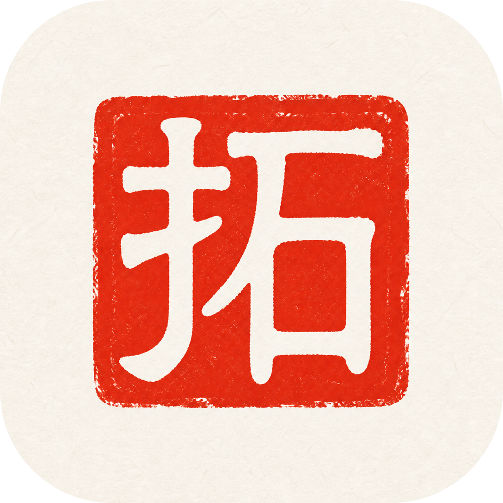
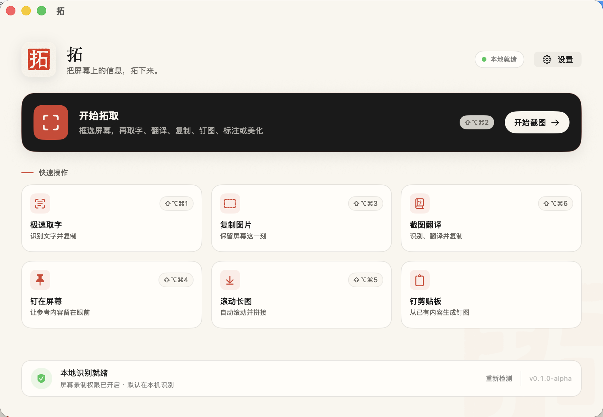

<div align="center">



# 拓 · Ta

### 一千多年前，纸墨拓下碑文。今天，AI 拓下屏幕上的信息。

[](./LICENSE)
[](https://www.apple.com/macos/)
[](https://www.swift.org/)
[](#当前状态)

**AI 原生截图工具：截图、取字、翻译、长截图、钉图与标注，一步完成。**

[简体中文](./README.md) · [English](./README.en.md) · [日本語](./README.ja.md)

</div>



## 一千多年前，中国人就有了自己的“截图”

在没有相机、复印机和现代印刷技术的年代，人们遇到过一个很实际的问题：石碑上的字那么好，怎样才能把它带走？

他们把纸覆在碑上，再用墨包轻轻扑打。纸揭下来，文字便离开石头，跟着人回家。这门手艺叫作**拓印**，已经流传千余年。它像一种古老的截图：看见什么，就把什么留住。

「拓」这个字本身也在讲这件事：`扌 + 石`，一只手按在石头上。中文名为「拓」，读作 `tà`；英文名为 **Ta**。

今天，石碑变成了屏幕。屏幕上的信息更多，也消失得更快。Ta 做的仍是同一件事：框住它，拓下来——文字可以复制、翻译，图片可以标注、钉在眼前；截一张长图，就像把整通碑从头拓到尾；AI 帮你理解内容，就像随身带着一位金石学家。

> 仓颉造字，拓印传字。字被造出来只是开始，被留住、被读懂、被带走，才算完成。

## 我为什么做 Ta

截图工具是我几乎每天都在使用的软件。市面上的选择很多，有免费的，也有收费的；但用了这么多之后，我始终没有找到一个能满足全部需求的工具：取字、翻译、长截图、钉图、标注和图片美化，往往分散在不同应用和不同操作链路里。

所以，我决定自己做一个。

我也发现，大多数截图软件只是附加了一个 OCR 或 AI 按钮，还没有真正让 AI 深度参与截图后的工作。Ta 希望持续结合 AI，在满足我自己真实需求的同时，也和大家一起把截图这件每天都要做的小事，变得更简单、更聪明。

## 什么是“AI 原生截图工具”

AI 原生，不是给传统截图软件外挂一个聊天框，而是让 AI 从截图完成的那一刻起就参与工作：

- **拓下来**：普通截图、窗口内容和滚动长图，都能快速捕获；
- **读出来**：使用本地 OCR 或多模态模型提取文字、表格、公式与代码；
- **讲明白**：直接翻译、理解和结构化截图中的信息；
- **留在手边**：一键复制、钉图、标注、美化、保存或继续处理；
- **尊重边界**：本地识别优先，云端处理前明确提示，API Key 保存在 macOS Keychain。

## 它解决了什么问题

- **截图后还要二次处理**——取字、翻译、复制、保存和标注集中在同一条操作链路。
- **长截图不稳定**——支持手动或自动滚动、重复帧过滤、固定区域消除、接缝检查与人工修正。
- **OCR 方案难以取舍**——Apple Vision、PaddleOCR 与远程视觉模型可以按速度、结构和隐私要求切换。
- **截图标注效率低**——提供接近 Snipaste 的原位标注、对象移动缩放、马赛克涂抹和钉图体验。
- **云端识图缺少边界**——默认本地处理；需要上传时明确提示，并把 API Key 保存在 macOS Keychain。

## 它是怎么工作的

Ta 使用一条原生 macOS 截图链路：

```text
全局快捷键
    ↓
框选屏幕区域
    ↓
ScreenCaptureKit 捕获（排除 Ta 自身窗口）
    ↓
┌───────────────┬────────────────────┐
│ 本地 OCR      │ 多模态视觉模型       │
│ Apple Vision  │ OpenAI-compatible  │
│ PaddleOCR     │ Claude / Gemini    │
└───────────────┴────────────────────┘
    ↓
复制 · 翻译 · 钉图 · 标注 · 长图 · 保存
```

识别期间如果用户已经复制了其他内容，Ta 不会覆盖新的剪贴板内容。没有识别到文字时，可以安全回退为复制 PNG。

## 核心功能

### 截图与快捷操作

- 通用截图操作栏：框选后选择取字、AI 识图、翻译、复制、钉图、标注、美化或保存。
- 极速取字、复制图片、截图翻译、截图钉图与滚动长截图均有独立全局快捷键。
- 所有快捷键都可以在设置中录制、检查冲突并恢复默认值。
- 框选过程中可用鼠标右键或 `Escape` 退出，不生成文件也不修改剪贴板。
- 截图时自动隐藏 Ta 的主界面，不抢焦点、不把应用自身截进去。

### OCR 与 AI 识图

- **Apple Vision**：默认的本地 OCR，支持中英文与常见文本布局。
- **PaddleOCR 增强包**：Apple Silicon 离线运行，支持一键安装、更新、校验、预热和常驻模型复用。
- **DeepSeek-OCR-2**：连接用户自行部署的 vLLM、SGLang 或兼容视觉服务，不在 Mac 上静默下载大型权重。
- **多模态模型**：支持 OpenAI-compatible、Azure OpenAI、Anthropic Claude 与 Google Gemini 协议。
- 任务模板包括精确取字、代码解释、Markdown/CSV 表格、LaTeX 公式与通用识图。
- 支持 OCR、多模态和“本地优先、低置信度再确认上传”的智能路由。

### 截图翻译

- 源语言与目标语言可自定义，默认自动检测并翻译为简体中文。
- 直接截图翻译后把译文复制到剪贴板。
- 截图工具栏支持纯文字、原图文字替换与原图下方双语对照。
- 图片文字定位和结果合成在本地完成，只把需要翻译的文字发送给配置的模型。

### 滚动长截图

- 支持浏览器、聊天窗口和常见桌面应用的手动/自动滚动捕获。
- 自动匹配相邻帧、过滤重复画面并识别滚动方向。
- 检测并消除固定标题栏、底栏和输入框。
- 完成前提供接缝检查，可按 `±1` / `±10 px` 人工修正。
- 支持超长图片分段，降低内存和导出压力。

### 标注与钉图

- 原位半透明遮罩标注，截图保持在原位置。
- 矩形、椭圆、箭头、画笔、高亮、文字、编号、马赛克、模糊、橡皮和局部放大。
- 标注对象可以直接选择、移动、缩放、旋转和重新编辑。
- 马赛克支持框选与画笔涂抹两种方式。
- 钉图支持拖动、缩放、透明度、旋转、翻转、滤镜、裁剪、鼠标穿透、分组、隐藏/恢复与双击关闭。
- 可从截图、剪贴板图片、文字、HTML 或文件生成钉图。

## 快速开始

### 环境要求

- macOS 14 或更高版本
- Apple Silicon 或 Intel Mac（PaddleOCR 发行增强包目前面向 Apple Silicon）
- Xcode 26，或兼容 Swift 6.2 的工具链

### 从源码构建

```bash
git clone https://github.com/kangarooking/Ta.git
cd Ta
swift test
./scripts/build-app.sh
open "artifacts/拓.app"
```

首次运行需要允许“屏幕与系统音频录制”权限。只有使用自动滚动长截图时，才需要额外开启“辅助功能”权限。

### 默认快捷键

| 功能 | 快捷键 |
|------|--------|
| 极速取字 | `⇧⌥⌘1` |
| 通用截图 | `⇧⌥⌘2` |
| 复制图片 | `⇧⌥⌘3` |
| 截图并钉住 | `⇧⌥⌘4` |
| 滚动长截图 | `⇧⌥⌘5` |
| 截图翻译 | `⇧⌥⌘6` |

进入“设置 → 快捷键”可以重新录制任意组合键。冲突快捷键会被拒绝或自动回滚。

## 隐私与安全

- 普通截图与 Apple Vision OCR 始终在本机完成。
- PaddleOCR 增强包安装后在本机离线运行。
- 只有主动选择远程 OCR、多模态识图或翻译时，选区或文字才会发送到用户配置的服务。
- 低置信度智能路由不会静默上传，必须由用户再次确认。
- API Key 只保存在 macOS Keychain，不写入偏好设置、日志或仓库。
- Ta 不持续录屏，只读取用户主动框选的区域。

## 工程结构

```text
Ta/
├── README.md / README.en.md / README.ja.md
├── Package.swift
├── Resources/                 图标、Info.plist 与品牌资源
├── Sources/
│   ├── AIScreenshotCore/
│   │   ├── OCR/               Vision OCR、布局与内容分类
│   │   ├── LongCapture/       位移匹配、拼接与进度检测
│   │   ├── Recognition/       OCR/视觉/翻译 Provider 客户端
│   │   └── Clipboard/         剪贴板安全提交策略
│   └── AIScreenshotApp/
│       ├── Capture/           框选、捕获与长截图会话
│       ├── Editor/            标注编辑器
│       ├── Recognition/       OCR 增强包与多模态路由
│       ├── System/            快捷键、权限、Keychain、剪贴板
│       └── UI/                主界面、菜单栏、设置、钉图与结果栏
├── Tests/                     Core 与 App 测试
├── ocr-packs/paddleocr/       可选 PaddleOCR 增强包构建定义
├── scripts/                   构建、运行和增强包脚本
└── docs/                      PRD、研究、验证记录与实现计划
```

## 当前状态

Ta 目前处于 **Alpha** 阶段，核心链路已经可运行，但还不是经过公证的正式发行版本。

已知限制：

- 当前区域框选以鼠标所在显示器为主，跨屏框选与窗口自动吸附尚未完成。
- 长截图已具备自动拼接与接缝修正，但持续动画、视频、半透明浮层和大幅重排页面仍可能需要人工调整。
- 图片翻译使用本地遮盖和重绘；复杂纹理、渐变、阴影、竖排文字和极密集排版可能留下覆盖痕迹。
- PaddleOCR 公开仓库包含增强包构建定义，不提交体积较大的本地构建产物。
- 本地构建优先使用 Apple Development 签名；公开分发仍需要 Developer ID 签名和 Apple notarization。

## 文档

- [产品需求文档（中文）](./AI截图软件-产品需求文档-PRD-v1.0.md)
- [市场与用户痛点调研（中文）](./AI截图软件市场与用户痛点调研.md)
- [Alpha 验证记录](./docs/alpha-verification.md)
- [长截图验收矩阵](./docs/long-capture-acceptance-matrix.md)
- [PaddleOCR 增强包规范](./docs/ocr-enhancement-pack-spec.md)

## Roadmap

- [x] 原生截图、OCR、复制与自定义快捷键
- [x] 长截图、接缝检查与自动滚动
- [x] 原位标注、马赛克画笔与钉图
- [x] 截图翻译与多 Provider 模型配置
- [x] PaddleOCR 可选离线增强包协议
- [ ] 多显示器跨屏框选与窗口吸附
- [ ] 公众号截图模板与参数化美化
- [ ] 历史记录、搜索与结果重新复制
- [ ] Developer ID 签名、公证与公开安装包

## 免费、开源，也希望和大家一起做

Ta 采用 [MIT 协议](./LICENSE) 免费开源。任何人都可以下载源码、构建、使用、修改和分发。

项目目前仍在 Alpha 阶段。如果你在截图时遇到过 Ta 尚未解决的问题，欢迎提交 Issue；如果你愿意一起完善它，也欢迎发送 Pull Request。开始修改前请阅读 [CONTRIBUTING.md](./CONTRIBUTING.md)，并尽量为行为变化补充测试或验收步骤。

如果 Ta 帮你少切换一次应用、少做一步重复操作，欢迎点一个 **Star**。这就是对项目最直接的支持。

## 关于作者

**袋鼠帝 kangarooking** — AI 博主、独立开发者，公众号「袋鼠帝 AI 客栈」主理人。

| 平台 | 链接 |
|------|------|
| GitHub | [@kangarooking](https://github.com/kangarooking) |
| X / Twitter | [@aikangarooking](https://x.com/aikangarooking) |
| Cangjie Skill | [kangarooking/cangjie-skill](https://github.com/kangarooking/cangjie-skill) |

## ⭐ Star History

如果 Ta 对你有帮助，欢迎点一个 Star。

<a href="https://www.star-history.com/?repos=kangarooking%2FTa&type=date&legend=top-left">
 <picture>
   <source media="(prefers-color-scheme: dark)" srcset="https://api.star-history.com/chart?repos=kangarooking/Ta&type=date&legend=top-left" />
   <source media="(prefers-color-scheme: light)" srcset="https://api.star-history.com/chart?repos=kangarooking/Ta&type=date&legend=top-left" />
   
 </picture>
</a>

## License

MIT，详见 [LICENSE](./LICENSE)。
