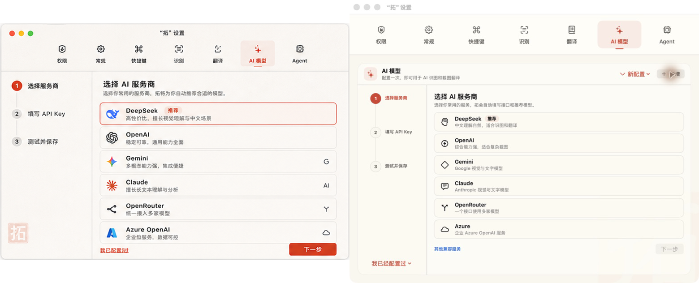
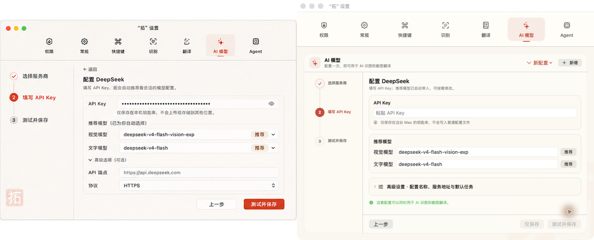
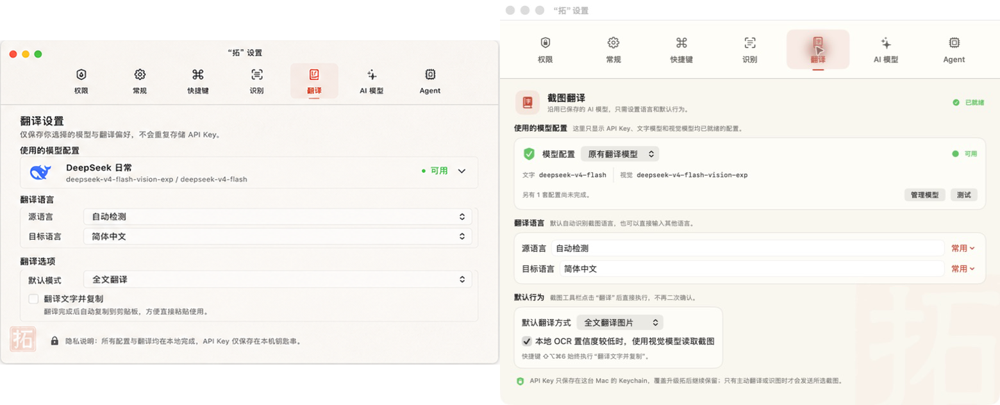

# Design QA — 轻向导 AI 设置

- 日期：2026-08-26
- 设计来源：`docs/design-qa/2026-08-26-guided-ai-settings/source-option-1.png`
- 实现应用：`artifacts/拓.app`
- 目标窗口：780 × 600 pt
- 实际截图：780 × 632 px（包含 32 px macOS 标题栏，内容区为 780 × 600）
- 验收状态：新增配置 → 选择服务商、填写 API Key、翻译设置

## 对照图

左侧是用户确认的方案 1，右侧是真实构建运行截图。

### 1. 选择服务商

### 2. 填写 API Key 与推荐模型

### 3. 翻译复用已保存模型

### 4. Dock 图标视觉占比

印章原图保持不变，仅在 ICNS 画布内缩放至 82%，增加透明安全区，避免在 Dock 中比其他 App 显得更大。

## 视觉与交互检查

- 通过：设置窗口保持原有 780 × 600，没有为了向导扩大窗口。
- 通过：三步进度始终可见，当前步骤使用朱砂红，已完成步骤使用勾选状态。
- 通过：DeepSeek、OpenAI、Gemini、Claude、OpenRouter、Azure 和其他兼容服务均可进入后续配置。
- 通过：常用服务自动填充端点、协议和推荐视觉/文字模型；高级参数默认折叠。
- 通过：API Key 仍存入 macOS Keychain，现有配置和升级后的持久化标识未改变。
- 通过：翻译页只展示 API Key、文字模型、视觉模型均完整的配置，不重复要求填写 Key。
- 通过：主要按钮、信息卡、分区间距和品牌色与确认稿一致，并适配现有紧凑窗口。
- 通过：真实 App 中逐页点击验证了服务商选择、DeepSeek 推荐模型、模型复用和翻译默认行为。
- 通过：Dock 图标未重绘、未翻转、未裁切，透明安全区四周一致。

## 验证记录

1. 首轮：真实 App 中发现旧进程仍在显示上一版页面；退出后从 `artifacts/拓.app` 重新启动。
2. 第二轮：检查 780 × 600 设置窗口、服务商选择、DeepSeek 配置和翻译模型复用，均符合确认稿与现有数据结构。
3. 最终：154 个 XCTest 通过，2 个显式外部集成测试跳过；另有 41 个 Swift Testing 用例通过。

final result: passed
