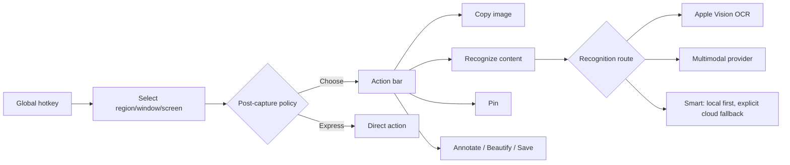

# Snipaste Parity and Recognition Routing Implementation Plan

> **For Claude:** REQUIRED SUB-SKILL: Use superpowers:executing-plans to implement this plan task-by-task.

**Goal:** Build a Snipaste-class capture foundation whose post-capture action is configurable, while keeping local OCR and multimodal recognition as explicit, independently selectable paths.

**Architecture:** Capture, post-capture action, recognition engine, clipboard commit, pinning, editing, and export are separate stages. A normal capture pauses after selection and exposes actions; express hotkeys bypass the chooser. Local OCR is always available, while multimodal recognition is an opt-in provider capability and smart routing never silently uploads unless the user explicitly enables that policy.

**Tech Stack:** Swift 6.2, SwiftUI, AppKit, ScreenCaptureKit, Vision, Carbon, Keychain, URLSession for a later OpenAI-compatible multimodal adapter.

---

## Product decisions

### ADR-006: Mouse-up selects; it does not necessarily finish

- **Decision:** The normal screenshot command freezes the selection and shows a compact action bar.
- **Reason:** Users alternate between copying an image, extracting text, pinning, annotating, and beautifying. Finishing immediately on mouse-up makes the common non-OCR paths expensive.
- **Alternatives rejected:** A single global automatic action forces settings churn; only separate hotkeys creates a memorization burden.
- **Escape hatches:** Express hotkeys still provide zero-confirmation OCR, image copy, and pin workflows.

### ADR-007: Recognition is a strategy, not a capture mode

- **Decision:** `RecognitionRoute` is independent from `CaptureMode`.
- **Routes:** local OCR, multimodal model, and smart routing.
- **Privacy:** Local OCR never uploads. Multimodal recognition sends only the selected pixels after an explicit action or an explicitly enabled automatic policy.
- **Failure:** A missing provider or Key produces a configuration message; it must not silently fall back to a different external provider.

### ADR-008: Snipaste is a capability baseline, not a visual clone

- **Decision:** Match the useful behaviors and keyboard efficiency, while using original UI, copy, icons, and implementation.
- **Reason:** Feature parity reduces switching cost; copying protected assets or exact visual expression creates unnecessary product and legal risk.

## Target capture flow

## Settings model

### Post-capture default

- Ask every time (recommended)
- Extract content
- Copy image
- Pin to screen
- Open editor
- Remember last action

### Recognition route

- Local OCR: Apple Vision, no network or Key
- Multimodal model: selected OpenAI-compatible vision model
- Smart routing: local OCR first; cloud enhancement only under the configured privacy policy

### Express commands

- `⇧⌥⌘2`: normal screenshot and action bar
- `⇧⌥⌘1`: instant content extraction using the selected recognition route
- `⇧⌥⌘3`: instant image copy
- `⇧⌥⌘4`: instant pin

## Snipaste capability parity checklist

### Capture

- [ ] Region, window, active window, display, and fullscreen capture
- [ ] Window and interface-element detection, including hierarchy traversal
- [ ] Delayed capture, cursor inclusion, fixed size, fixed ratio, rounded corners
- [ ] Repeat last region, refresh capture, capture history replay
- [ ] Multi-display, mixed scale, keyboard pixel movement, magnifier, guides, dimensions
- [ ] Color picker with HEX/RGB/HSL output
- [ ] Auto-save, quick-save, native share, send to another application

### Post-capture actions

- [x] Copy image
- [x] Local OCR entry
- [x] Explicit multimodal recognition
- [x] Basic pin
- [ ] Save, quick-save, editor, beautify, QR/barcode actions（保存与基础编辑已完成）
- [x] Configurable default and remember-last-action policy

### Annotation

- [ ] Rectangle, ellipse, rounded rectangle
- [ ] Line, polyline, arrow, bidirectional and alternate arrow styles
- [ ] Pencil, marker, text, text background and outline
- [ ] Mosaic, blur, eraser, magnify, numbered steps
- [ ] Width, opacity, dashed styles, custom palettes
- [ ] Undo, redo, clear, select, free select, move, rotate, and re-edit

### Pinned image windows

- [x] Always-on-top image window
- [ ] Move, resize, zoom, opacity, rotate, mirror, crop
- [ ] Click-through, topmost toggle, cross-Space policy, solo mode
- [ ] Thumbnail mode, grouping, multi-select, hide/show all, recover last closed
- [ ] Paste image/text/HTML/color/file path/clipboard content as a pin
- [ ] Grayscale, inversion, alpha-background modes, editable color cards

### Automation and customization

- [ ] Custom global and in-app shortcuts with conflict detection
- [ ] Per-app hotkey blacklist and privacy policy
- [ ] Tray/menu actions and hot corners
- [ ] CLI and URL scheme for capture, output, pin, OCR, and workflow presets
- [ ] Customizable theme, magnifier, palettes, defaults, and import/export

### Product additions beyond Snipaste

- [ ] Long/scrolling screenshot with seam repair and sticky-region handling（向下手动滚动 MVP 已完成）
- [x] Local OCR plus multimodal recognition routing
- [ ] Code, table, formula, QR, and document-structure outputs
- [ ] AI annotation, privacy redaction, creator beautification, and multi-size export
- [ ] Local searchable history with OCR and optional semantic index

## Implementation tasks

### Task 1: Domain models and tests

**Files:**
- Modify: `Sources/AIScreenshotCore/Models/CaptureModels.swift`
- Modify: `Tests/AIScreenshotCoreTests/AIScreenshotCoreTests.swift`

1. Add `CaptureMode.interactive` and `CaptureMode.pin`.
2. Add `PostCaptureAction`, `CaptureQuickAction`, and `RecognitionRoute` raw-value enums.
3. Add tests for stable raw values and route/action mapping.
4. Run `swift test`; expected result: all tests pass.

### Task 2: Selection action bar

**Files:**
- Modify: `Sources/AIScreenshotApp/Capture/SelectionOverlayView.swift`
- Modify: `Sources/AIScreenshotApp/Capture/SelectionOverlayController.swift`

1. Freeze a valid selection on mouse-up in interactive mode.
2. Display actions for OCR, multimodal AI, copy image, pin, edit, beautify, and save.
3. Keep unsupported actions visible but clearly labeled as planned; never report false success.
4. Preserve Escape cancellation and add Enter/double-click image-copy behavior.

### Task 3: Capture routing and basic pinning

**Files:**
- Modify: `Sources/AIScreenshotApp/Capture/CaptureCoordinator.swift`
- Create: `Sources/AIScreenshotApp/UI/PinnedImageWindowController.swift`

1. Map normal capture policy or chosen toolbar action into a quick action.
2. Reuse a single captured `CGImage` for copy, OCR, and pin actions.
3. Implement a borderless always-on-top pin window with drag, close, and copy.
4. Keep clipboard race protection for every automatic commit.

### Task 4: Settings and hotkeys

**Files:**
- Modify: `Sources/AIScreenshotApp/System/GlobalHotKeyManager.swift`
- Modify: `Sources/AIScreenshotApp/App/AppModel.swift`
- Modify: `Sources/AIScreenshotApp/UI/MenuBarContentView.swift`
- Modify: `Sources/AIScreenshotApp/UI/SettingsView.swift`
- Modify: `Sources/AIScreenshotApp/UI/ModelSettingsView.swift`

1. Register normal capture, instant recognition, image copy, and pin shortcuts.
2. Add post-capture behavior and recognition-route settings.
3. Show provider readiness and the exact data boundary for multimodal recognition.
4. When multimodal execution is not connected, return a truthful configuration/availability result.

### Task 5: Verification

1. Run `swift test`; expected result: zero failures.
2. Run `scripts/build-app.sh`; expected result: valid stable-signed app bundle.
3. Open the app and verify all four entry points.
4. Verify normal capture stays open after mouse-up and each implemented action succeeds.
5. Verify the settings survive quit/relaunch and no local-only action reads the API Key.
