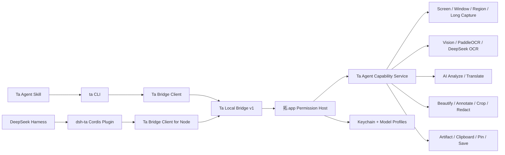

# 拓 Agent 集成（Skill、CLI 与 DeepSeek Harness 插件）Implementation Plan

> **For Claude:** REQUIRED SUB-SKILL: Use superpowers:executing-plans to implement this plan task-by-task.

**Goal:** 将「拓」建设为 Agent 的视觉输入与图片处理层，以 Agent Skill、`ta` CLI 和 DeepSeek Harness 原生插件包三种形式开放截图、理解图片、翻译、图片处理与结果交付能力。

**Architecture:** 所有能力只在拓 App 及其共享能力层中实现一次，由持有 macOS 权限、模型配置和 Keychain 的拓 App 通过本机 Unix Domain Socket 提供版本化 Bridge。Skill 调用 CLI，CLI 和 DeepSeek Harness 原生插件分别作为 Bridge 的轻量客户端；当前范围不实现 MCP，但 Bridge 协议保留未来增加其他适配器的能力。

**Tech Stack:** Swift 6.2、Swift Package Manager、AppKit、ScreenCaptureKit、Vision、Security/Keychain、Unix Domain Socket、Codable、TypeScript、DeepSeek Harness Cordis、`@deepseek-ai/dsh-tools`、npm/TGZ、Agent Skills。

---

## 1. 文档状态

- 状态：已确认方案，待实施。
- 日期：2026-08-25。
- 当前平台：macOS 14 及以上。
- 当前交付范围：Agent Skill、CLI、DeepSeek Harness 原生插件包。
- 明确不在当前范围：MCP Server、远程 HTTP API、Windows Agent 后端、通用鼠标键盘自动化。
- 已确认的授权策略：用户完成一次 macOS 录屏授权后，Agent 可以自动执行普通截图。
- 默认体验：普通截图不激活拓、不弹主界面、不移动鼠标、不发送模拟键盘事件、不改变用户当前前台 App。

## 2. 产品定位

拓的 Agent 能力定位为：

> Agent 的视觉输入与图片处理层。

完整能力链路：

```text
Capture → Understand → Transform → Deliver
截下来  → 看懂它     → 处理它    → 交付结果
```

拓不在第一阶段发展成通用 Computer Use 工具。它不负责替 Agent 点击页面、填写表单或控制键盘，而是专注于：

- 获取屏幕、显示器、窗口、App、区域和长页面的视觉内容。
- 通过本地 OCR 或多模态模型理解截图。
- 提取文字、代码、表格、公式、二维码和结构化信息。
- 翻译、美化、标注、裁剪、缩放、脱敏和格式转换。
- 将结果保存、复制或钉在屏幕上。

## 3. 目标与非目标

### 3.1 目标

1. 同一套能力同时服务拓 GUI、Skill、CLI 和 DeepSeek Harness。
2. Agent 普通截图时不抢焦点、不干扰鼠标键盘。
3. 权限、API Key、模型配置统一由拓 App 管理。
4. CLI 提供稳定、可脚本化、可测试的 JSON 接口。
5. DeepSeek Harness 插件在 Harness 内原生注册工具，不以 MCP 冒充插件。
6. 图片不通过巨大 Base64 JSON 传输，而以受控的本地 Artifact 交付。
7. 所有云端上传行为可配置、可识别、可审计。
8. 最终覆盖拓已有的主要能力，而不是只做一个 OCR Demo。

### 3.2 非目标

- 当前不开发 MCP。
- 当前不提供局域网或公网服务。
- 当前不让 Agent 直接读取 Keychain 中的 API Key。
- 当前不尝试在任意原生 App 中实现完全离屏的长截图。
- 当前不把整个拓 App 打包进 DeepSeek Harness 的 npm 包。
- 当前不让 CLI 绕过拓 App 自己申请 Screen Recording 权限。

## 4. 三种交付物的职责

| 交付物 | 用户 | 职责 | 不负责 |
|---|---|---|---|
| Ta Agent Skill | 支持 Agent Skills 的 Agent | 教 Agent 选择命令、组合工作流、处理失败和保护隐私 | 不实现截图和图片算法 |
| `ta` CLI | 人、Shell、脚本、通用 Agent | 提供稳定命令、JSON 协议和诊断入口 | 不持有 API Key，不自行实现截图 |
| `dsh-ta` | DeepSeek Harness 用户 | 原生注册 Harness Tools、附件、后台任务和权限策略 | 不通过 MCP 转发，不复制拓的算法 |

三种形式不是三套实现。它们只是三个 Adapter，共同调用 Ta Local Bridge。

## 5. 总体架构



### 5.1 核心调用流程

1. Agent 调用 Skill 中描述的 `ta` 命令，或 Harness 直接调用 `dsh-ta` 注册的工具。
2. Adapter 创建带 `requestId` 的 Bridge 请求。
3. 如果拓未运行，Adapter 使用非激活方式启动拓，并传入 `--agent-bridge`。
4. 拓启动 Bridge，但不显示 Welcome、设置或截图框选界面。
5. `TaAgentCapabilityService` 校验权限、隐私策略、目标和模型路由。
6. 普通截图通过 ScreenCaptureKit 后台完成。
7. OCR、AI 和图片处理在捕获后的位图上异步执行。
8. 图片写入 Ta Agent Artifact 缓存，文本和元数据写入响应。
9. CLI 输出稳定 JSON；Harness 插件把图片导入 Harness Attachment Store。

## 6. 本机 Bridge 设计

### 6.1 为什么由拓 App 托管

拓 App 已经是 macOS 录屏权限、辅助功能权限、模型配置和 API Key 的可信宿主。如果 CLI 或 Harness 插件各自截图，会出现：

- 每个进程分别触发系统权限。
- TCC 身份随可执行文件变化。
- 模型配置和 Keychain 访问重复。
- PaddleOCR Worker 无法常驻预热。
- GUI 与 Agent 行为逐渐不一致。

因此采用 App-hosted Bridge，而不是 CLI-centered 或每个 Adapter 各自实现。

### 6.2 传输方式

- 类型：Unix Domain Socket。
- 默认路径：`~/Library/Application Support/Ta/agent-v1.sock`。
- 权限：Socket 文件仅当前用户可读写，创建后设置为 `0600`。
- 对端校验：服务端校验 peer UID 与当前登录用户一致。
- 网络边界：不监听 TCP，不提供远程访问。
- 编码：UTF-8 JSON，使用 4 字节大端长度前缀，避免 JSONL 被文本内容中的换行破坏。
- 图片：不放入 JSON；返回 Artifact 元数据和受控本地路径。

### 6.3 请求协议

```json
{
  "protocolVersion": 1,
  "requestId": "ta_01J...",
  "method": "capture.frontmost",
  "params": {
    "includeCursor": false,
    "includeShadow": true
  },
  "client": {
    "name": "ta-cli",
    "version": "1.0.0"
  }
}
```

### 6.4 成功响应

```json
{
  "protocolVersion": 1,
  "requestId": "ta_01J...",
  "ok": true,
  "data": {
    "target": {
      "kind": "window",
      "appName": "Safari",
      "bundleIdentifier": "com.apple.Safari",
      "windowId": 1284
    }
  },
  "artifacts": [
    {
      "id": "artifact_01J...",
      "path": "/Users/example/Library/Caches/Ta/AgentRuns/ta_01J.../capture.png",
      "mimeType": "image/png",
      "width": 1512,
      "height": 982,
      "bytes": 483921,
      "sha256": "...",
      "expiresAt": "2026-08-26T10:00:00Z"
    }
  ],
  "meta": {
    "durationMs": 286,
    "cloudUploaded": false
  }
}
```

### 6.5 失败响应

```json
{
  "protocolVersion": 1,
  "requestId": "ta_01J...",
  "ok": false,
  "error": {
    "code": "SCREEN_PERMISSION_REQUIRED",
    "message": "拓尚未获得录屏权限。",
    "hint": "打开拓 → 设置 → 权限并启用屏幕录制。",
    "retryable": false
  }
}
```

### 6.6 首批错误码

| 错误码 | 含义 | 是否建议重试 |
|---|---|---|
| `TA_APP_NOT_INSTALLED` | 找不到拓 App | 否 |
| `BRIDGE_UNAVAILABLE` | Bridge 未启动或连接失败 | 是，最多一次 |
| `PROTOCOL_VERSION_MISMATCH` | Adapter 与 App 不兼容 | 否 |
| `SCREEN_PERMISSION_REQUIRED` | 未获录屏权限 | 否 |
| `ACCESSIBILITY_PERMISSION_REQUIRED` | 长截图需要辅助功能权限 | 否 |
| `TARGET_NOT_FOUND` | 指定窗口或 App 已消失 | 可重新列举目标 |
| `TARGET_CHANGED` | 自动截图时目标发生变化 | 可按策略重试一次 |
| `TARGET_BLOCKED_BY_PRIVACY_POLICY` | 命中禁止截图名单 | 否 |
| `CAPTURE_BUSY` | 已有互斥截图任务 | 是 |
| `OCR_ENGINE_UNAVAILABLE` | OCR 引擎不可用 | 可切换引擎 |
| `MODEL_PROFILE_NOT_CONFIGURED` | 未配置模型 | 否 |
| `CLOUD_UPLOAD_NOT_ALLOWED` | 当前策略禁止上传 | 否 |
| `USER_ACTIVITY_DETECTED` | 长截图时检测到用户操作 | 等待空闲后重试 |
| `ARTIFACT_EXPIRED` | 临时图片已清理 | 重新执行 |
| `CANCELLED` | 调用被用户或 Agent 取消 | 视任务决定 |

## 7. 无感截图设计

### 7.1 默认 Agent 截图模式

Agent 普通截图默认使用 `silent` 策略：

- 用户只需给拓 App 完成一次 Screen Recording 授权。
- 请求到达时立即记录 `NSWorkspace.shared.frontmostApplication`。
- 在任何可能激活拓的动作之前冻结目标 PID、窗口列表和显示器信息。
- 使用 `SCShareableContent` 和 `SCContentFilter` 选择窗口、App 或显示器。
- 使用 `SCScreenshotManager.captureImage` 获取单帧。
- 设置 `showsCursor = false`。
- 不调用 `NSApplication.activate()`。
- 不调用 `makeKeyAndOrderFront()`。
- 不显示 Selection Overlay。
- 不执行 `CGWarpMouseCursorPosition`。
- 不生成鼠标点击、滚轮或键盘事件。
- 截图完成后前台 App、键盘焦点和鼠标位置保持不变。

### 7.2 无感支持矩阵

| 能力 | 是否可完全无感 | 说明 |
|---|---|---|
| 截整个显示器 | 是 | ScreenCaptureKit 单帧截图 |
| 截前台窗口 | 是 | 请求开始时冻结目标窗口 |
| 截指定 App/窗口 | 是 | 按 bundle ID 或 window ID 过滤 |
| 截已知坐标区域 | 是 | 不弹框选层 |
| OCR/AI 识图/翻译 | 是 | 在截图位图上后台处理 |
| 美化/裁剪/格式转换 | 是 | 离屏渲染 |
| 保存文件 | 是 | 不打开保存面板时 |
| 复制 | 基本无感 | 会按调用意图修改剪贴板 |
| 钉图 | 否 | 会出现图片窗口，但不得抢焦点 |
| 交互框选 | 否 | 必须显示覆盖层并接管一次鼠标操作 |
| 标注编辑器 | 否 | 用户明确要求打开编辑界面 |
| 浏览器完整网页长截图 | 可无感 | 后续通过浏览器原生能力/CDP/扩展获取 |
| 任意原生 App 长截图 | 不能保证 | 必须改变目标滚动视图内容 |

### 7.3 长截图三级策略

1. `silent`：只使用不会改变用户界面的离屏能力；不满足条件时返回明确错误。
2. `idle`：等待用户短暂空闲后滚动目标视图；检测到鼠标或键盘活动立即暂停。
3. `interactive`：用户明确确认后执行当前长截图流程并显示状态。

默认 Agent 策略为 `silent`。任何原生 App 长截图都不得把鼠标强制移动到屏幕中央；如果必须滚动，只改变目标滚动视图，并在用户开始操作时暂停。

## 8. Agent Capability Service

### 8.1 能力分组

```text
system.*       状态、版本、能力、权限
target.*       显示器、App、窗口发现
capture.*      显示器、窗口、前台窗口、区域、交互、长截图
recognize.*    OCR、代码、表格、公式、二维码
analyze.*      描述、问答、结构化理解
translate.*    文字翻译、图片全文翻译
transform.*    美化、标注、裁剪、缩放、模糊、马赛克、脱敏
deliver.*      Artifact、复制、保存、钉图
job.*          查询、取消长任务
```

### 8.2 首期能力

- `system.status`
- `system.capabilities`
- `system.permissions`
- `target.listDisplays`
- `target.listWindows`
- `capture.display`
- `capture.frontmost`
- `capture.window`
- `capture.region`
- `recognize.ocr`
- `analyze.image`
- `translate.text`
- `translate.image`
- `deliver.copy`
- `deliver.save`

### 8.3 后续覆盖全部拓能力

- 浏览器和原生 App 长截图。
- 钉图及边框、阴影、透明度等配置。
- 图片美化预设。
- JSON Recipe 标注。
- 框选和涂抹马赛克。
- 高亮、编号、箭头和文字。
- 隐私信息识别与脱敏。
- 表格、公式和二维码结构化输出。
- 图片翻译与双语排版。

## 9. `ta` CLI 方案

### 9.1 命令原则

- 人类默认得到简洁文本。
- Agent 使用 `--json` 得到稳定结构。
- stdout 只输出结果；日志和进度写入 stderr。
- 失败使用非零退出码。
- 命令参数不接收 API Key。
- 所有图片默认写入 Artifact 文件，不输出 Base64。
- 所有长任务支持 `--timeout` 和取消信号。

### 9.2 命令表

```bash
# 系统
ta status --json
ta capabilities --json
ta permissions --json

# 目标发现
ta screen list --json
ta window list --json
ta window list --app Safari --json

# 截图
ta capture screen --display 1 --output capture.png --json
ta capture frontmost --output frontmost.png --json
ta capture window --window-id 1284 --json
ta capture window --app Safari --title "GitHub" --json
ta capture region --x 100 --y 100 --width 800 --height 600 --json
ta capture interactive --json
ta capture scroll --target frontmost --policy idle --json

# 理解
ta ocr last --engine auto --json
ta ocr ./capture.png --engine apple-vision --json
ta analyze last --task describe --json
ta analyze last --task extract-code --json
ta analyze last --task table --json
ta analyze last --prompt "找出图片中的报错原因" --json
ta translate last --to zh-CN --mode text --json
ta translate last --to zh-CN --mode image --json

# 处理
ta beautify last --preset wechat --json
ta transform last --recipe ./recipe.json --json
ta annotate last --interactive
ta redact last --detect text,face,qrcode --json

# 交付
ta copy last --json
ta save last --output ~/Desktop/result.png --json
ta pin last --border true --shadow true --json

# 任务
ta job status <job-id> --json
ta job cancel <job-id> --json
```

### 9.3 通用输入

命令接受统一的图片引用：

- `last`：最近一次 Ta Agent Artifact。
- `clipboard`：当前剪贴板图片。
- 本地绝对或相对路径。
- `artifact:<id>`：指定 Artifact。
- `capture:<request-id>`：指定截图请求的首个图片结果。

### 9.4 通用参数

```text
--json
--output <path>
--timeout <seconds>
--profile <model-profile-name>
--request-id <id>
--policy silent|idle|interactive
--cloud auto|allow|deny
--dry-run
```

## 10. Ta Agent Skill 方案

### 10.1 目录

```text
Integrations/AgentSkill/ta/
├── SKILL.md
├── references/
│   ├── commands.md
│   ├── capture-targeting.md
│   ├── image-understanding.md
│   ├── editing-recipes.md
│   ├── privacy-and-safety.md
│   └── error-codes.md
└── scripts/
    └── check-ta.sh
```

### 10.2 Skill 的路由规则

- 先运行 `ta status --json`，确认 App、Bridge 和权限。
- 只需要文字时优先本地 OCR，不把截图上传云端。
- 需要语义、表格、公式或复杂版面时再调用 `ta analyze`。
- “当前页面”默认解释为调用瞬间的前台窗口，不弹交互框。
- 目标不明确时使用 `ta window list`，不要猜 window ID。
- 涉及密码管理器、银行、隐私窗口时停止并请求用户确认。
- 长截图默认 `silent`；无法无感时报告原因，不偷偷切换为 `interactive`。
- 图片处理后必须检查 Artifact 存在、尺寸和 MIME 类型。
- 不把“命令已发出”描述为“截图已成功”，必须读取 `ok` 和 Artifact。

### 10.3 Skill 与 Harness 的关系

Skill 是通用的 Agent 操作知识，默认通过 CLI 工作。DeepSeek Harness 插件的 Tool 描述与 Skill 共享同一份能力词汇，但 Harness 插件不通过 Shell 调用 CLI。发布 Harness Bundle 时可以附带同一份 Skill，源文件仍以 `Integrations/AgentSkill/ta/` 为唯一事实来源，打包时复制，避免维护两份。

## 11. DeepSeek Harness 原生插件包

### 11.1 正确定义

DeepSeek Harness Plugin 是导出 `apply(ctx)` 的 Cordis 模块；用户安装的分发物是声明 `dsh.bundle` 的 npm/TGZ Bundle。拓需要同时提供真正的插件代码和 Bundle 配置，而不是只配置一个 MCP Client。

官方资料：

- [DeepSeek Harness Architecture](https://github.com/deepseek-ai/deepseek-harness/blob/master/docs/architecture.md)
- [Your first plugin](https://github.com/deepseek-ai/deepseek-harness/blob/master/docs/user/develop/basic/index.md)
- [Build a tool](https://github.com/deepseek-ai/deepseek-harness/blob/master/docs/user/develop/basic/tool.md)
- [Package and install a plugin](https://github.com/deepseek-ai/deepseek-harness/blob/master/docs/user/develop/basic/publish.md)
- [Durable Image Attachments](https://github.com/deepseek-ai/deepseek-harness/blob/master/docs/subsystems/attachment.md)

### 11.2 包结构

```text
Integrations/DeepSeekHarness/dsh-ta/
├── package.json
├── cordis.patch.yml
├── tsconfig.json
├── src/
│   ├── index.ts
│   ├── config.ts
│   ├── bridge-client.ts
│   ├── schemas.ts
│   ├── errors.ts
│   ├── attachments.ts
│   └── tools/
│       ├── system.ts
│       ├── capture.ts
│       ├── recognize.ts
│       ├── translate.ts
│       ├── transform.ts
│       └── deliver.ts
├── tests/
│   ├── bridge-client.test.ts
│   ├── tool-registration.test.ts
│   ├── image-attachment.test.ts
│   └── bundle-install.test.ts
└── scripts/
    └── preflight.mjs
```

### 11.3 Bundle Manifest

```json
{
  "name": "dsh-ta",
  "version": "1.0.0",
  "type": "module",
  "main": "./dist/index.js",
  "files": ["dist", "cordis.patch.yml", "README.md"],
  "scripts": {
    "build": "tsc -p tsconfig.json",
    "test": "node --test dist/tests/*.test.js",
    "prepack": "npm run build && npm test"
  },
  "dsh": {
    "bundle": {
      "patch": "./cordis.patch.yml"
    }
  }
}
```

### 11.4 Cordis Patch

```yaml
- insert:
    - id: ta-tools
      name: dsh-ta
      config:
        socketPath: auto
        capturePolicy: silent
        launchTaIfNeeded: true
```

### 11.5 原生 Tool 注册

插件注入 Harness 的 `tools`、`attachments`，需要长任务时再注入 `jobs`。每个工具使用 `defineTool()` 注册：

```typescript
export const inject = ["tools", "attachments"]

export function apply(ctx: Context, config: Config) {
  ctx.tools.register(defineTool({
    name: "ta_capture",
    description: "Capture a display, frontmost window, named window, or region with Ta.",
    parameters: {
      target: {
        type: "string",
        required: true,
        enum: ["screen", "frontmost", "window", "region"]
      },
      window_id: { type: "number" },
      output_path: { type: "string" }
    },
    output: {
      schema: {
        type: "object",
        additionalProperties: false,
        properties: {
          requestId: { type: "string" },
          artifact: { type: "object" },
          target: { type: "object" }
        },
        required: ["requestId", "artifact", "target"]
      },
      render: (_args, value) => renderCaptureResult(value)
    },
    async execute(args, exec) {
      return taBridge.capture(args, exec.signal)
    }
  }))
}
```

### 11.6 图片进入 Harness

1. Ta Bridge 返回 Artifact 路径、MIME、尺寸和哈希。
2. 插件按大小上限读取图片。
3. 插件调用 `ctx.attachments.saveImage()` 写入 Harness 的内容寻址存储。
4. Tool Result 返回 Attachment Ref 和必要元数据。
5. `output.render` 为视觉模型生成 ImageBlock；文本模型得到文件元数据和 Ta 的 OCR/分析文本。

这样会话日志不保存临时文件路径或 Base64，也能在会话恢复时继续引用图片。

### 11.7 安装与卸载

```bash
dsh plugin --profile web add dsh-ta
dsh --profile web --dump-config
dsh plugin --profile web remove dsh-ta
```

GitHub Release 可同时提供：

```text
dsh-ta-1.0.0.tgz
dsh-ta-1.0.0.tgz.sha256
```

安装插件不等于安装拓 App。Preflight 必须检查 `/Applications/拓.app`、Bridge 协议版本和权限，并给出明确安装链接或修复提示。

## 12. 权限、隐私与安全

### 12.1 权限归属

- Screen Recording：只授予拓 App。
- Accessibility：仅普通截图以外的特定长截图流程需要。
- API Key：只存储在拓 App 的 Keychain。
- CLI/Harness：只能传模型 Profile 名称，不能导出 Key。
- 文件写入：只有用户指定输出目录或 Ta Artifact 缓存。

### 12.2 截图隐私策略

设置中增加“Agent 与自动化”页面：

- 总开关：允许 Agent 调用拓。
- 自动截图：允许/禁止。
- 默认截图策略：`silent`、`idle`、`interactive`。
- 云端识图：允许、每次询问、禁止。
- 隐私 App 黑名单。
- 是否允许截取拓自身。
- Artifact 保留时长。
- 最近调用记录与一键清理。

建议默认加入提醒但不强制禁止：

- 密码管理器。
- 银行和支付 App。
- 系统密码输入窗口。
- 用户自定义 Bundle ID。

### 12.3 调用审计

只记录：

- `requestId`。
- 调用来源（CLI/Harness）。
- 方法和目标类型。
- App bundle ID，不记录窗口正文。
- 使用的本地/云端引擎。
- 耗时、成功或错误码。
- Artifact ID 和过期时间。

日志不记录：

- API Key。
- OCR 全文。
- 图片像素。
- 用户自定义 Prompt 正文，除非用户主动开启调试模式。

## 13. Artifact 生命周期

- 默认目录：`~/Library/Caches/Ta/AgentRuns/<request-id>/`。
- 默认保留：24 小时。
- `ta save` 的用户输出不参与自动清理。
- 文件名使用安全固定格式，不拼接窗口标题。
- 写入完成后再原子发布 Artifact 元数据。
- 每个 Artifact 记录 MIME、尺寸、字节数和 SHA-256。
- App 启动和每日定时清理过期缓存。
- 设置中提供“立即清理 Agent 缓存”。

## 14. 非功能需求

### 14.1 性能

- App 已运行时，Bridge 建连 p95 小于 50ms。
- CLI 自身启动与参数解析开销 p95 小于 150ms。
- 普通截图热路径 p95 小于 800ms。
- 典型中英文截图 Apple Vision OCR 目标小于 5 秒。
- Harness Adapter 额外开销不超过 200ms，不含模型推理。
- 普通截图不得等待主线程 UI 动画。

### 14.2 体验

- 普通 Agent 截图前后前台 PID 保持一致。
- 普通 Agent 截图前后鼠标坐标保持一致。
- 截图期间用户键盘输入继续发送给原 App。
- 后台启动拓不显示 Welcome，不弹到 Dock 前台。
- 失败不无限重试；Bridge 自动重连最多一次。
- 长截图检测到用户活动后在 100ms 内停止发送后续滚动动作。

### 14.3 可靠性

- Bridge 请求具备唯一 `requestId`。
- 复制、保存和钉图等有副作用操作不能因重试执行两次。
- 同时只允许一个交互截图或长截图任务。
- 普通静默截图可串行排队，队列达到上限后返回 `CAPTURE_BUSY`。
- 客户端断开后取消尚未发布的普通任务。
- 已发布的后台任务由 Job ID 管理。

### 14.4 兼容性

- Bridge 协议独立于 App 版本，第一版为 `protocolVersion: 1`。
- 客户端先进行 handshake，再发送能力请求。
- CLI、Skill、Harness 插件分别版本化。
- Harness 插件遵循其当前正式 npm engine 和 Cordis API，不把开发机 Node 版本写死为永久要求。
- Windows 未来通过替换 Capture Provider 接入，不改变 CLI 顶层词汇。

## 15. 失败模式与处理

| 失败模式 | 影响 | 处理 |
|---|---|---|
| 拓未安装 | 所有调用不可用 | Preflight 和 CLI 输出安装提示 |
| 拓未运行 | 首次连接失败 | 非激活启动一次并等待 Socket |
| Socket 残留 | 无法连接 | 验证 PID/握手后清理无主 Socket |
| 权限未开启 | 截图失败 | 返回设置路径，不循环弹权限 |
| 用户快速切换 App | 目标可能变化 | 请求到达时冻结目标；不跨目标悄悄重试 |
| 窗口已关闭 | window ID 失效 | 返回 `TARGET_NOT_FOUND` 并建议重新 list |
| OCR Pack 未安装 | 指定引擎失败 | `auto` 回退 Apple Vision；显式引擎不静默回退 |
| 云端模型未配置 | AI 任务失败 | 返回缺失的 Profile，不暴露 Key |
| 用户操作长截图窗口 | 拼接可能错误 | 暂停任务并返回可恢复状态 |
| 图片超过 Harness 限额 | 无法进入附件 | 保留 Artifact，返回缩略图或文件元数据 |
| Adapter/App 版本不兼容 | 协议失败 | handshake 明确提示升级哪一端 |

## 16. 架构决策记录

### ADR-001：当前不实现 MCP

**状态：** Accepted

**上下文：** 当前明确需要 Skill、CLI 和 DeepSeek Harness。MCP 会增加第四套公开协议、测试和发布面，而 Harness 已支持原生插件。

**决定：** 当前不实现 MCP。Skill 使用 CLI，Harness 使用原生 Cordis 插件。Bridge 保持 Adapter-neutral，未来确有用户需求时再增加 MCP Adapter。

**后果：**

- 正面：范围更小，能够把 CLI 和 Harness 原生体验做好。
- 正面：减少重复 Schema、文档和兼容测试。
- 负面：只支持 MCP 的 Agent 暂时只能通过 CLI/Skill 使用。

### ADR-002：拓 App 作为权限宿主

**状态：** Accepted

**决定：** ScreenCaptureKit、Accessibility、Keychain、OCR Worker 和模型配置全部留在拓 App；Adapter 通过 Local Bridge 请求能力。

**备选方案：** CLI 直接截图。拒绝原因是 TCC 权限重复、配置分裂、Worker 冷启动和 GUI/Agent 行为漂移。

### ADR-003：DeepSeek Harness 使用原生 Cordis 插件

**状态：** Accepted

**决定：** 开发 `dsh-ta`，在 Harness 中使用 `ctx.tools.register(defineTool(...))` 注册工具，并以声明 `dsh.bundle` 的 npm/TGZ 包分发。

**备选方案：** 只安装 MCP Client。拒绝原因是它不等于 Harness 原生插件，无法充分使用 Attachment、Job、Policy、Code Mode 和 UI Card。

### ADR-004：普通截图默认 silent

**状态：** Accepted

**决定：** 用户一次授权后，普通 Agent 截图不再逐次确认；默认不激活拓、不显示覆盖层、不移动鼠标、不发送输入事件。

**限制：** 交互框选、钉图和任意原生 App 长截图本身会造成可见变化，必须使用对应的风险策略。

### ADR-005：图片以 Artifact 传输

**状态：** Accepted

**决定：** Bridge 和 CLI JSON 只返回图片文件元数据；Harness 插件将图片导入其 Attachment Store。

**备选方案：** Base64 内嵌 JSON。拒绝原因是体积、内存、日志泄露和超长图片兼容问题。

## 17. 仓库目标结构

```text
Sources/
├── AIScreenshotCore/
├── AIScreenshotApp/
│   └── Agent/
│       ├── TaAgentCapabilityService.swift
│       ├── TaAgentCaptureService.swift
│       ├── TaAgentArtifactStore.swift
│       ├── TaAgentPrivacyPolicy.swift
│       └── Bridge/
│           ├── TaAgentBridgeServer.swift
│           ├── TaAgentBridgeConnection.swift
│           └── TaAgentRequestRouter.swift
├── TaAgentContracts/
│   ├── AgentEnvelope.swift
│   ├── AgentMethods.swift
│   ├── AgentArtifacts.swift
│   └── AgentErrors.swift
├── TaAgentClient/
│   ├── TaBridgeClient.swift
│   └── TaAppLauncher.swift
└── TaCLI/
    ├── TaCLI.swift
    ├── CLIParser.swift
    ├── CLICommands.swift
    └── CLIOutput.swift

Tests/
├── TaAgentContractsTests/
├── TaAgentClientTests/
├── TaCLITests/
└── AIScreenshotAppTests/

Integrations/
├── AgentSkill/ta/
└── DeepSeekHarness/dsh-ta/

docs/plans/
└── 2026-08-25-ta-agent-skill-cli-deepseek-harness.md
```

## 18. 分阶段实施

### Phase 0：契约冻结

交付：Bridge v1 方法表、Envelope、Error Code、Artifact Schema、三种 Adapter 的命名规范。

验收：不启动 App 也能通过 Fixture 完成编码、解码、版本不兼容和错误响应测试。

### Phase 1：无感截图底座

交付：App-hosted Bridge、非激活启动、状态/权限/窗口发现、显示器/前台窗口/指定窗口/区域截图、Artifact Store。

验收：跨 Safari、Chrome、微信、Codex、Finder 连续截图，不抢焦点和鼠标键盘。

### Phase 2：CLI 与 Skill

交付：`ta`、稳定 JSON、OCR、AI 识图、翻译、保存、复制、Skill 和安装检查。

验收：至少三个不同 Agent 能依照 Skill 完成“截图 → OCR”“截图 → 识图”“截图 → 翻译”。

### Phase 3：DeepSeek Harness 原生插件

交付：`dsh-ta`、Cordis Tool、Attachment、取消、TGZ、安装测试。

验收：`dsh plugin add` 后工具出现在 Web 与 headless profile；图片能够进入视觉模型上下文，文本模型能得到 Ta 分析结果。

### Phase 4：全部图片处理能力

交付：美化、JSON 标注 Recipe、脱敏、钉图、长截图和任务管理。

验收：CLI、Harness 与 GUI 对同一输入使用相同引擎并得到一致输出。

## 19. 详细实施任务

### Task 1：建立 TaAgentContracts

**Files:**

- Modify: `Package.swift`
- Create: `Sources/TaAgentContracts/AgentEnvelope.swift`
- Create: `Sources/TaAgentContracts/AgentMethods.swift`
- Create: `Sources/TaAgentContracts/AgentArtifacts.swift`
- Create: `Sources/TaAgentContracts/AgentErrors.swift`
- Create: `Tests/TaAgentContractsTests/AgentEnvelopeTests.swift`

**Steps:**

1. 写失败测试：成功、失败、Artifact、未知协议版本的 JSON round-trip。
2. 运行 `swift test --filter TaAgentContractsTests`，确认目标尚不存在而失败。
3. 在 `Package.swift` 添加 `TaAgentContracts` library 和 test target。
4. 实现 `AgentRequestEnvelope`、`AgentResponseEnvelope`、`AgentArtifact` 和 `AgentErrorPayload`。
5. 运行目标测试并确认通过。
6. 运行 `swift test` 确认现有测试不回归。
7. 提交：`git commit -m "feat(agent): add versioned bridge contracts"`。

### Task 2：建立 Artifact Store

**Files:**

- Create: `Sources/AIScreenshotApp/Agent/TaAgentArtifactStore.swift`
- Create: `Tests/AIScreenshotAppTests/TaAgentArtifactStoreTests.swift`

**Steps:**

1. 写失败测试：原子写 PNG、计算哈希、拒绝不安全文件名、清理过期文件。
2. 运行 `swift test --filter TaAgentArtifactStoreTests` 确认失败。
3. 实现缓存目录和 Artifact 元数据生成。
4. 注入 Clock 和根目录，保证测试不操作真实用户缓存。
5. 运行目标测试和全量测试。
6. 提交：`git commit -m "feat(agent): add managed artifact store"`。

### Task 3：建立 Bridge Server 与 Client

**Files:**

- Modify: `Package.swift`
- Create: `Sources/AIScreenshotApp/Agent/Bridge/TaAgentBridgeServer.swift`
- Create: `Sources/AIScreenshotApp/Agent/Bridge/TaAgentBridgeConnection.swift`
- Create: `Sources/AIScreenshotApp/Agent/Bridge/TaAgentRequestRouter.swift`
- Create: `Sources/TaAgentClient/TaBridgeClient.swift`
- Create: `Tests/TaAgentClientTests/TaBridgeClientTests.swift`
- Create: `Tests/AIScreenshotAppTests/TaAgentBridgeServerTests.swift`

**Steps:**

1. 写失败测试：handshake、长度前缀拆包、并发连接、取消、错误响应。
2. 添加 `TaAgentClient` target。
3. 实现只监听 Unix Socket 的服务端。
4. 设置 Socket 权限并校验 peer UID。
5. 实现客户端超时和一次重连。
6. 验证服务端不监听 TCP 端口。
7. 运行全量 Swift 测试。
8. 提交：`git commit -m "feat(agent): add local bridge transport"`。

### Task 4：实现 Agent 非激活启动

**Files:**

- Modify: `Sources/AIScreenshotApp/App/AppModel.swift`
- Modify: `Sources/AIScreenshotApp/App/AppDelegate.swift`
- Create: `Sources/TaAgentClient/TaAppLauncher.swift`
- Create: `Tests/AIScreenshotAppTests/AgentLaunchModeTests.swift`

**Steps:**

1. 写失败测试：`--agent-bridge` 启动时不调用 `showWelcome()`。
2. 为 App 启动参数增加 Agent launch reason。
3. 启动 Bridge 后跳过 Welcome 延迟任务。
4. Launcher 使用非激活方式启动 `/Applications/拓.app`。
5. 手工验证启动前后的 `NSWorkspace.shared.frontmostApplication` PID 不变。
6. 运行测试并提交：`git commit -m "feat(agent): launch Ta without stealing focus"`。

### Task 5：实现静默截图能力

**Files:**

- Create: `Sources/AIScreenshotApp/Agent/TaAgentCaptureService.swift`
- Modify: `Sources/AIScreenshotApp/Capture/ScreenCaptureService.swift`
- Create: `Tests/AIScreenshotAppTests/TaAgentCaptureServiceTests.swift`

**Steps:**

1. 写失败测试：目标冻结、窗口过滤、坐标换算、隐藏鼠标、目标消失。
2. 把 ScreenCaptureKit 的通用单帧逻辑提取为 GUI 和 Agent 共用实现。
3. 实现 display/frontmost/window/region 四种目标。
4. 确保 Agent 路径不依赖 Selection Overlay。
5. 增加 `TARGET_CHANGED` 和 `TARGET_NOT_FOUND` 映射。
6. 运行单元测试。
7. 按第 20 节执行跨 App 手工验收。
8. 提交：`git commit -m "feat(agent): add silent screen capture targets"`。

### Task 6：实现 Agent Capability Service

**Files:**

- Create: `Sources/AIScreenshotApp/Agent/TaAgentCapabilityService.swift`
- Create: `Sources/AIScreenshotApp/Agent/TaAgentPrivacyPolicy.swift`
- Modify: `Sources/AIScreenshotApp/App/AppModel.swift`
- Create: `Tests/AIScreenshotAppTests/TaAgentCapabilityServiceTests.swift`

**Steps:**

1. 写失败测试：status、permissions、capture、ocr、analyze、translate、save。
2. 组合现有 `ConfiguredOCRService`、`MultimodalRecognitionService`、`ScreenshotTranslationService` 和导出服务。
3. 禁止 Capability Service 返回 API Key。
4. 实现 cloud policy 和隐私 App denylist。
5. 将 Router 方法映射到 Capability Service。
6. 运行测试并提交：`git commit -m "feat(agent): expose Ta capabilities through bridge"`。

### Task 7：实现 `ta` CLI

**Files:**

- Modify: `Package.swift`
- Create: `Sources/TaCLI/TaCLI.swift`
- Create: `Sources/TaCLI/CLIParser.swift`
- Create: `Sources/TaCLI/CLICommands.swift`
- Create: `Sources/TaCLI/CLIOutput.swift`
- Create: `Tests/TaCLITests/CLIParserTests.swift`
- Create: `Tests/TaCLITests/CLIGoldenOutputTests.swift`

**Steps:**

1. 写解析测试和 JSON Golden Tests。
2. 添加 `ta` executable product。
3. 实现 status、capabilities、permissions、screen/window list。
4. 实现 capture、ocr、analyze、translate、copy、save。
5. 保证 stdout/stderr 和退出码契约。
6. 增加 SIGINT → Bridge cancel。
7. 运行 `swift test --filter TaCLITests` 和全量测试。
8. 提交：`git commit -m "feat(cli): add Ta agent command line interface"`。

### Task 8：编写 Ta Agent Skill

**Files:**

- Create: `Integrations/AgentSkill/ta/SKILL.md`
- Create: `Integrations/AgentSkill/ta/references/commands.md`
- Create: `Integrations/AgentSkill/ta/references/capture-targeting.md`
- Create: `Integrations/AgentSkill/ta/references/image-understanding.md`
- Create: `Integrations/AgentSkill/ta/references/editing-recipes.md`
- Create: `Integrations/AgentSkill/ta/references/privacy-and-safety.md`
- Create: `Integrations/AgentSkill/ta/references/error-codes.md`
- Create: `Integrations/AgentSkill/ta/scripts/check-ta.sh`

**Steps:**

1. 编写短入口和渐进式 references。
2. 让 `check-ta.sh` 只调用 `ta status --json`，不读取 Keychain。
3. 使用无拓、无权限、正常、云端被禁止四种 Fixture 验证 Skill 提示。
4. 用至少三个 Agent 进行实际调用测试。
5. 提交：`git commit -m "feat(skill): add Ta agent workflow skill"`。

### Task 9：实现 DeepSeek Harness 原生插件

**Files:**

- Create: `Integrations/DeepSeekHarness/dsh-ta/package.json`
- Create: `Integrations/DeepSeekHarness/dsh-ta/cordis.patch.yml`
- Create: `Integrations/DeepSeekHarness/dsh-ta/tsconfig.json`
- Create: `Integrations/DeepSeekHarness/dsh-ta/src/index.ts`
- Create: `Integrations/DeepSeekHarness/dsh-ta/src/bridge-client.ts`
- Create: `Integrations/DeepSeekHarness/dsh-ta/src/attachments.ts`
- Create: `Integrations/DeepSeekHarness/dsh-ta/src/tools/*.ts`
- Create: `Integrations/DeepSeekHarness/dsh-ta/tests/*.test.ts`

**Steps:**

1. 写 Bridge Client Fixture 测试。
2. 写 Tool 注册与参数 Schema 测试。
3. 实现 `apply(ctx)` 并注入 tools/attachments。
4. 注册 system、capture、recognize、translate、transform、deliver 工具。
5. 把 Artifact 导入 Harness Attachment Store。
6. 传递 `exec.signal` 到 Bridge cancel。
7. 运行 npm test 和 pack。
8. 在临时 `DSH_HOME` 中执行 `dsh plugin add`、`--dump-config`、调用、remove。
9. 提交：`git commit -m "feat(harness): add native Ta Cordis plugin bundle"`。

### Task 10：设置页和审计

**Files:**

- Create: `Sources/AIScreenshotApp/UI/AgentSettingsView.swift`
- Modify: `Sources/AIScreenshotApp/UI/SettingsView.swift`
- Create: `Sources/AIScreenshotApp/Agent/TaAgentAuditLog.swift`
- Create: `Tests/AIScreenshotAppTests/AgentSettingsTests.swift`

**Steps:**

1. 写设置持久化和隐私默认值测试。
2. 增加“Agent 与自动化”页面。
3. 增加总开关、策略、云端、黑名单、缓存和最近调用。
4. 确认日志不包含 Key、OCR 全文和图片数据。
5. 运行 UI Smoke 和全量测试。
6. 提交：`git commit -m "feat(agent): add automation privacy settings"`。

### Task 11：发布与文档

**Files:**

- Modify: `README.md`
- Modify: `README.en.md`
- Modify: `README.ja.md`
- Modify: `scripts/package-release.sh`
- Create: `scripts/package-ta-cli.sh`
- Create: `scripts/package-dsh-ta.sh`
- Create: `docs/agent-integration.md`

**Steps:**

1. 构建 Universal 或按架构分别发布的 `ta` CLI。
2. 将 CLI 与 App 版本和 Bridge 协议写入 manifest。
3. 生成 Harness TGZ 和 SHA-256。
4. README 增加 Skill、CLI、Harness 安装与真实案例。
5. 对三个语言版本检查命令一致性。
6. 从干净机器视角执行安装文档。
7. 提交：`git commit -m "docs(agent): publish Ta integration guides"`。

## 20. 必须执行的手工验收

### 20.1 普通截图无干扰

对 Safari、Chrome、Finder、微信、Codex 和拓自身分别执行：

1. 让目标 App 保持前台并在输入框持续输入。
2. 从另一个 Agent 触发 `ta capture frontmost --json`。
3. 验证前台 PID 未变化。
4. 验证鼠标坐标未变化。
5. 验证输入仍进入目标 App。
6. 验证拓 Welcome 和设置没有出现。
7. 验证图片目标正确，不是旧窗口。
8. 连续执行 50 次，确认没有偶发抢焦点。

### 20.2 Harness

1. 临时 `DSH_HOME` 安装 TGZ。
2. `--dump-config` 能看到 `dsh-ta` layer 和工具行。
3. Web 与 headless profile 均能调用 `ta_status`。
4. 视觉模型调用 `ta_capture` 后收到有效 Image Attachment。
5. 文本模型调用 `ta_ocr` 后收到结构化文字。
6. 中途取消 AI/长任务能终止 Bridge 工作。
7. 卸载 Bundle 后工具自动消失。

### 20.3 隐私与安全

1. 禁止列表中的 App 返回明确拒绝。
2. `cloud=deny` 时不发起任何网络模型请求。
3. CLI JSON、日志和 Harness Tool Result 中不存在 API Key。
4. 其他本地用户不能连接 Socket。
5. Artifact 过期后无法继续读取并被实际删除。

## 21. 完成定义

本方案只有同时满足以下条件才算完成：

- 三种交付物均实际可安装和调用，而不只是仓库中存在文件。
- CLI 与 Harness 调用同一个 App-hosted Capability Service。
- 普通 Agent 截图通过跨 App 无焦点、无鼠标键盘干扰验收。
- OCR、AI 识图、翻译、图片处理至少各有一个真实端到端案例。
- Harness 插件是真正的 Cordis Plugin + Bundle，不是 MCP 配置别名。
- Skill 不包含重复实现，且能够指导 Agent 正确验证结果。
- 权限、Keychain、云端上传和 Artifact 生命周期通过安全测试。
- README 中文、英文、日文说明与实际安装包一致。

## 22. 后续可能演进

当前不做 MCP，但以下条件出现时可以新增 Adapter：

- 用户明确需要只支持 MCP 的 Agent。
- CLI 方式无法提供图片附件或取消语义。
- Bridge v1 已稳定，增加 Adapter 不会反向改变核心协议。

未来演进仍应坚持：

```text
新增 Adapter，而不是新增一套截图实现。
```

